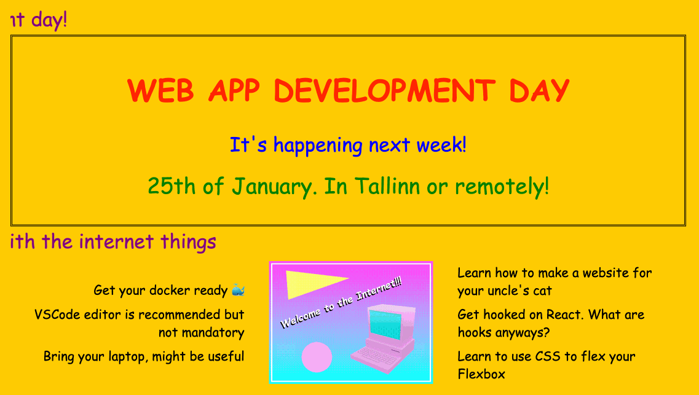

# Starship Web Dev Workshop

- [Setup](docs/setup.md)
- [Create a component](docs/create-component.md)
- [React basics](docs/react-basics.md)
- [Fetching live data](docs/fetch-data.md)
- [Loading state & ux improvements](docs/loading-state-ux.md)
- [Error handling and caching](docs/error-handling-caching.md)
- [Improving design](docs/improving-design.md)
- [Adding pages](docs/adding-pages.md)
- [Consuming GraphQL APIs](docs/consuming-graphql-apis.md)
- [Displaying data in tables](docs/tables.md)
- [Detail pages & Path parameters](docs/detail-pages.md)
- [GraphQL mutations](docs/graphql-mutations.md)

