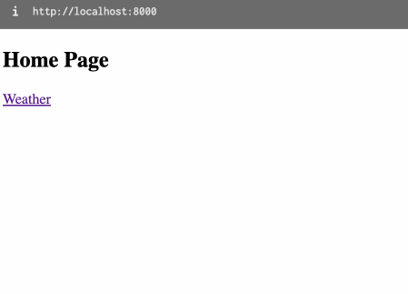
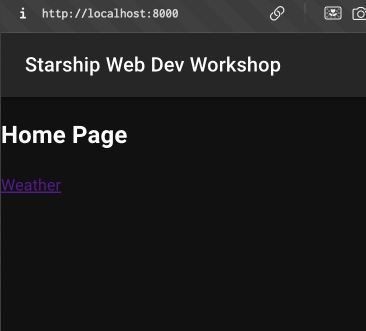
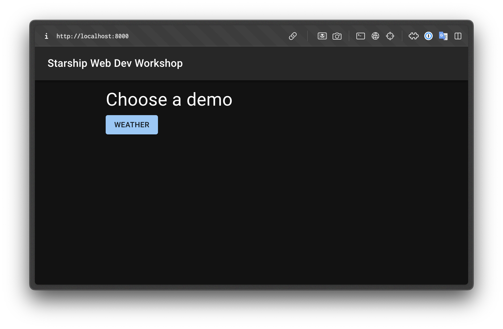
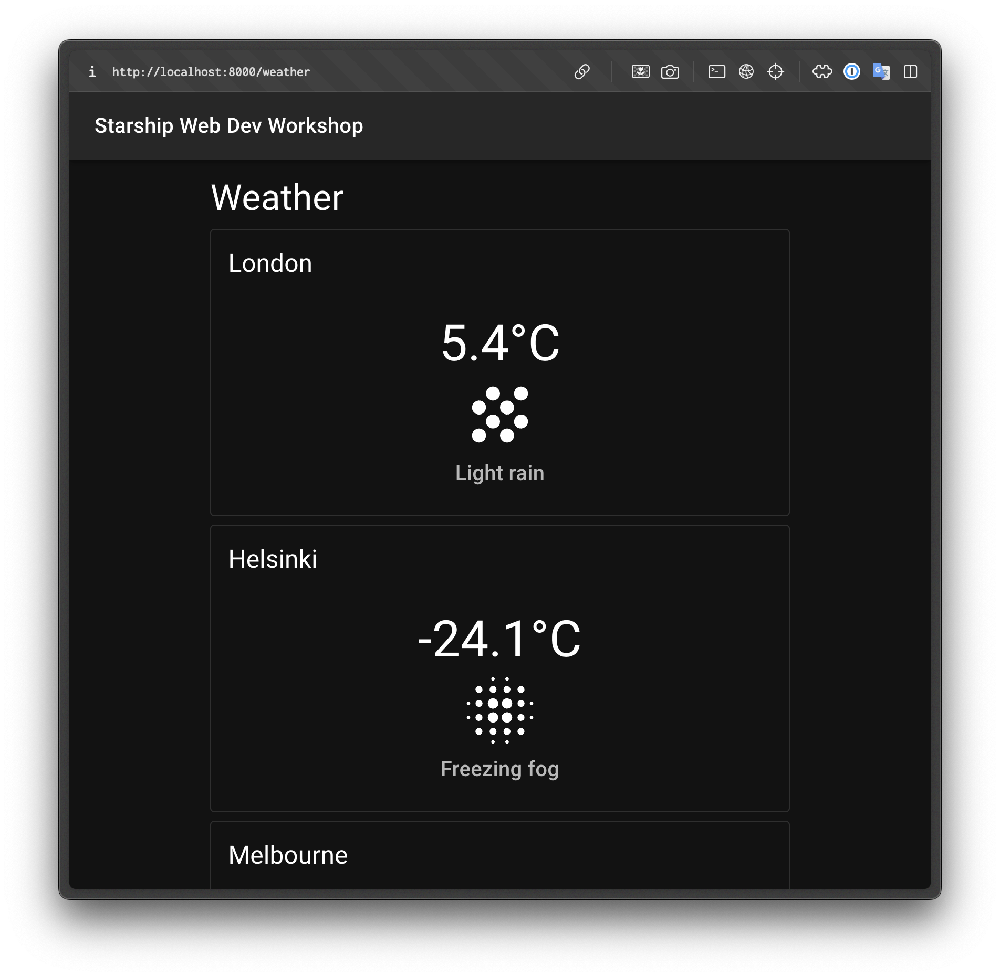
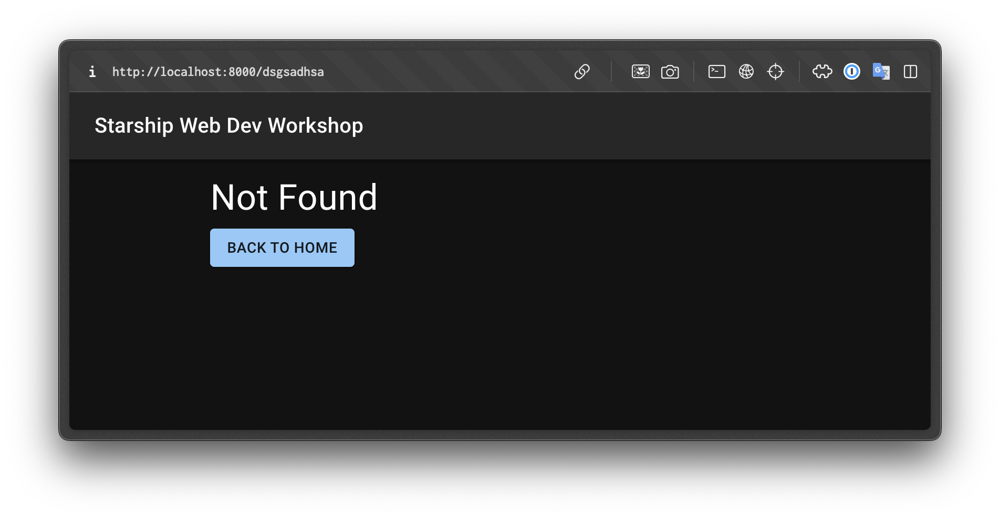
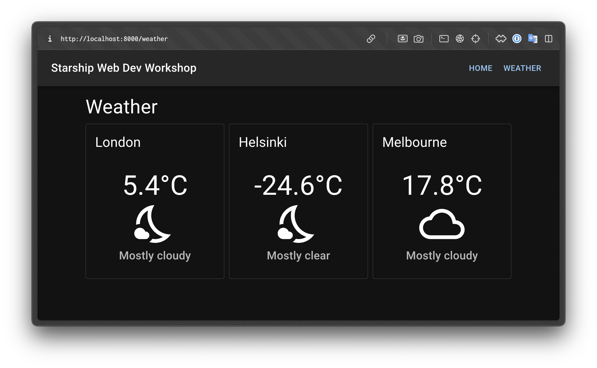

# Adding Pages

Websites usually have more than one page. Let's learn how can we add more pages to our app.

We'll use [react-router](https://reactrouter.com/)'s BrowserRouter implementation.

React-Router is an utility for us to define our page routes and their React components. When a user goes to a defined path, React-Router renders the corresponding component.

## Implementing React-Router

Let's remove `PageLayout` and move `CityWeatherContainer`s into a new file and implement `react-router`'s `BrowserRouter` and `Routes`:

**src/App.tsx**

```diff
  import "@fontsource/roboto/500.css";
  import "@fontsource/roboto/700.css";
  import { QueryClient, QueryClientProvider } from "@tanstack/react-query";
- import CityWeatherContainer from "./components/CityWeatherContainer";
- import PageLayout from "./components/PageLayout";
- import Box from "@mui/material/Box";
+ import { Route, Routes, BrowserRouter } from "react-router-dom";
+ import HomePage from "./pages/HomePage";
+ import WeatherPage from "./pages/WeatherPage";
+ import NotFoundPage from "./pages/NotFoundPage";

  const queryClient = new QueryClient();

  function App() {
    return (
      <QueryClientProvider client={queryClient}>
-       <PageLayout>
-         <Box
-           sx={{
-             display: "flex",
-             gap: 1,
-             padding: 2,
-             flexDirection: {
-               xs: "column",
-               sm: "column",
-               md: "row",
-               lg: "row",
-               xl: "row",
-             },
-           }}
-         >
-           <CityWeatherContainer city="London" />
-           <CityWeatherContainer city="Helsinki" />
-           <CityWeatherContainer city="Melbourne" />
-         </Box>
-       </PageLayout>
+       <BrowserRouter>
+         <Routes>
+           <Route path="/" element={<HomePage />} />
+           <Route path="/weather" element={<WeatherPage />} />
+           <Route path="*" element={<NotFoundPage />} />
+         </Routes>
+       </BrowserRouter>
      </QueryClientProvider>
    );
  }
```

We have now defined 3 routes `HomePage`, `WeatherPage` and `NotFoundPage`. We'll implement their components passed as element props.

Move the weather components we removed from `App.tsx` into a new file `src/pages/WeatherPage.tsx`:

**\*src/pages/WeatherPage.tsx**

```tsx
import CityWeatherContainer from "../components/CityWeatherContainer";
import Box from "@mui/material/Box";

export default function WeatherPage() {
  return (
    <div>
      <h2>Weather Page</h2>
      <Box
        sx={{
          display: "flex",
          gap: 1,
          padding: 2,
          flexDirection: {
            xs: "column",
            sm: "column",
            md: "row",
            lg: "row",
            xl: "row",
          },
        }}
      >
        <CityWeatherContainer city="London" />
        <CityWeatherContainer city="Helsinki" />
        <CityWeatherContainer city="Melbourne" />
      </Box>
    </div>
  );
}
```

Next, create the home page component:

**src/pages/HomePage.tsx**

```tsx
import { Link } from "react-router-dom";

export default function HomePage() {
  return (
    <div>
      <h2>Home Page</h2>
      <Link to="/weather">Weather</Link>
    </div>
  );
}
```

and the `NotFoundPage` component:

**src/pages/NotFoundPage.tsx**

```tsx
import { Link } from "react-router-dom";

export default function NotFoundPage() {
  return (
    <div>
      <h2>Not Found</h2>
      <Link to="/">Home</Link>
    </div>
  );
}
```

When you go to `localhost:8000` you should see a page with the title "Home Page" and a link to a weather page. Clicking it will take you to the `/weather` page.

You can click back in your browser to go back to the root path `/` , our Home page.

If you go to any other path than `/` or `/weather`, the `NotFoundPage` will be rendered.



## Nested Layouts

When we modified the `App.tsx` to implement `BrowserRouter` and `Routes`, we removed the `PageLayout` wrapper. Let's bring it back.

First we need to change the `PageLayout` so that it can work as a root route for our nested routes. This means it will wrap all the page routes and display it's `PageHeader` above all pages.

**src/components/PageLayout.tsx**

```diff
  import { createTheme } from "@mui/material/styles";
  import useMediaQuery from "@mui/material/useMediaQuery";
  import { useMemo } from "react";
  import PageHeader from "./PageHeader";
+ import { Outlet } from "react-router-dom";

- type PageLayoutProps = {
-   children: React.ReactNode;
- };
-
- export default function PageLayout({ children }: PageLayoutProps) {
+ export default function PageLayout() {
    const prefersDarkMode = useMediaQuery("(prefers-color-scheme: dark)");

    const theme = useMemo(
      <ThemeProvider theme={theme}>
        <CssBaseline />
        <PageHeader />
-       {children}
+       <Outlet />
      </ThemeProvider>
    );
  }
```

We deleted the `PageLayoutProps` altogether since we won't take `children` props anymore. In React-Router, nested route's children routes are injected into `<Outlet />` element's instead. That's why we replaced `{children}` with `<Outlet />`.

Next is to implement nested routes in `App.tsx`

We will handle `/` as the root path and render a `PageLayout` for it. All the existing `Route`s go under the `/` route definition as children.

We then remove `/` from the paths because it is already being handled by the parent router like so;

- `/` becomes `index`
- `/weather` becomes `weather`

**src/App.tsx**

```diff
  import { Route, Routes, BrowserRouter } from "react-router-dom";
  import HomePage from "./pages/HomePage";
  import WeatherPage from "./pages/WeatherPage";
  import NotFoundPage from "./pages/NotFoundPage";
+ import PageLayout from "./components/PageLayout";

  const queryClient = new QueryClient();

  function App() {
      <QueryClientProvider client={queryClient}>
        <BrowserRouter>
          <Routes>
-           <Route path="/" element={<HomePage />} />
-           <Route path="/weather" element={<WeatherPage />} />
-           <Route path="*" element={<NotFoundPage />} />
+           <Route path="/" element={<PageLayout />}>
+             <Route index element={<HomePage />} />
+             <Route path="weather" element={<WeatherPage />} />
+             <Route path="*" element={<NotFoundPage />} />
+           </Route>
          </Routes>
        </BrowserRouter>
      </QueryClientProvider>
```

Now if you check `localhost:8000` you'll see that we got `PageLayout`s Header back.



## Common page styles

Let's add some common page elements and styles to the`PageLayout` component:

**src/components/PageLayout.tsx**

```diff
 import { ThemeProvider } from "@emotion/react";
 import CssBaseline from "@mui/material/CssBaseline";
+import Box from "@mui/material/Box";
 import { createTheme } from "@mui/material/styles";
 import useMediaQuery from "@mui/material/useMediaQuery";
 import { useMemo } from "react";

    ...

     <ThemeProvider theme={theme}>
       <CssBaseline />
       <PageHeader />
+      <Box
+        sx={{
+          display: "flex",
+          width: "100%",
+          flexDirection: "row",
+          justifyContent: "center",
+          padding: 2,
+        }}
+      >
+        <Box
+          sx={{
+            display: "flex",
+            gap: 1,
+            flexDirection: "column",
+            alignItems: "flex-start",
+            width: {
+              xs: "100%",
+              sm: "70%",
+              md: 750,
+            },
+          }}
+        >
           <Outlet />
+        </Box>
+      </Box>
     </ThemeProvider>
   );
 }
```

Here we made it so that the page content is centered by the outer `Box` which has `100%` of the width of the window.

Then, we created another containing `Box` that has a certain width depending on the size of the page. In smaller sized screens, `xs` will use the maxmimum width it can and at `md` and beyond it won't exceed `750` pixels. This will allow content to appear at the center and not span far left or right at the edges of the page.

In `PageHeader` we can turn the title text into a link so that it directs to our home page '/':

**src/components/PageHeader.tsx**

```diff
 import AppBar from "@mui/material/AppBar";
 import Toolbar from "@mui/material/Toolbar";
 import Typography from "@mui/material/Typography";
+import { Link } from "react-router-dom";

 export default function PageHeader() {
   return (
     <AppBar position="static">
       <Toolbar>
-        <Typography variant="h6" component="div" sx={{ flexGrow: 1 }}>
+        <Typography
+          component={Link}
+          to="/"
+          variant="h6"
+          sx={{
+            textDecoration: "none",
+            color: "inherit",
+            flexGrow: 1,
+          }}
+        >
           Starship Web Dev Workshop
         </Typography>
       </Toolbar>
```

Let's update the pages with MUI components:

**src/components/WeatherPage.tsx**

```diff
 import CityWeatherContainer from "../components/CityWeatherContainer";
 import Box from "@mui/material/Box";
+import Typography from "@mui/material/Typography";

 export default function WeatherPage() {
   return (
-    <div>
-      <h2>Weather Page</h2>
+    <>
+      <Typography variant="h4" component="h2">
+        Weather
+      </Typography>
       <Box
         sx={{
           display: "flex",
           gap: 1,
-          padding: 2,
+          width: "100%",
           flexDirection: {
             xs: "column",
             sm: "column",

             ...

         <CityWeatherContainer city="Helsinki" />
         <CityWeatherContainer city="Melbourne" />
       </Box>
-    </div>
+    </>
   );
 }
```

Here we;

- changed the title into a MUI Typography title
- removed the padding because `PageLayout` now sets it
- made `WeatherPage`s wrapper take `100%` of the width because constrains are applied by the `PageLayout` anyways

**src/components/HomePage**

```diff
+import Button from "@mui/material/Button";
+import Typography from "@mui/material/Typography";
 import { Link } from "react-router-dom";

 export default function HomePage() {
   return (
-    <div>
-      <h2>Home Page</h2>
-      <Link to="/weather">Weather</Link>
-    </div>
+    <>
+      <Typography variant="h4" component="h2">
+        Choose a demo
+      </Typography>
+      <Button
+        component={Link}
+        to="/weather"
+        variant="contained"
+        color="primary"
+      >
+        Weather
+      </Button>
+    </>
   );
 }
```

Here, we;

- again, changed the title to MUI Typography component
- wrapped `Link` so that it is rendered as a MUI `Button` component

Finally similarly in the `NotFoundPage` we do the these changes:

**src/components/NotFoundPage.tsx**

```diff
 import { Link } from "react-router-dom";
+import Typography from "@mui/material/Typography";
+import Button from "@mui/material/Button";

 export default function NotFoundPage() {
   return (
-    <div>
-      <h2>Not Found</h2>
-      <Link to="/">Home</Link>
-    </div>
+    <>
+      <Typography variant="h4" component="h2">
+        Not Found
+      </Typography>
+      <Button component={Link} to="/" variant="contained" color="primary">
+        Back to home
+      </Button>
+    </>
   );
 }
```

Now when you try at `localhost:8000` pages should look like these.





## Navigation menu

Let's implement a navigation menu inside the `PageHeader`.

We can easily add this by inserting buttons into the `ToolBar` of the `PageHeader`:

**src/components/PageHeader.tsx**

```diff
 import AppBar from "@mui/material/AppBar";
 import Toolbar from "@mui/material/Toolbar";
 import Typography from "@mui/material/Typography";
+import Box from "@mui/material/Box";
+import Button from "@mui/material/Button";
 import { Link } from "react-router-dom";

+const menuItems: { title: string; path: string }[] = [
+  { title: "Home", path: "/" },
+  { title: "Weather", path: "/weather" },
+];
+
 export default function PageHeader() {
   return (
     <AppBar position="static">
         ...
           Starship Web Dev Workshop
         </Typography>
+        <Box>
+          {menuItems.map((item) => (
+            <Button component={Link} to={item.path} key={item.title}>
+              {item.title}
+            </Button>
+          ))}
+        </Box>
       </Toolbar>
     </AppBar>
   );
```

I defined the menu item `path`s and `title`s in an array above the component, instead of the layout, so that it would be easier to add/remove items from the menu later. We then loop over the `menuItems` array by `map` and render each item as `Button`s.

Clicking the buttons on the top right should take user to the associated pages. It should look like this.


