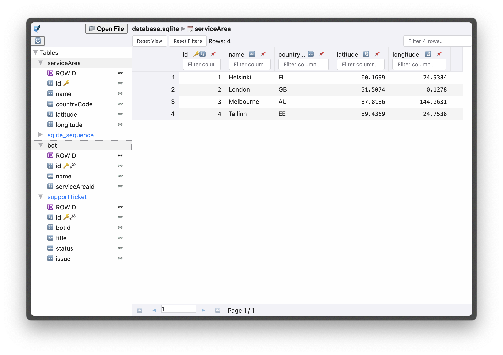
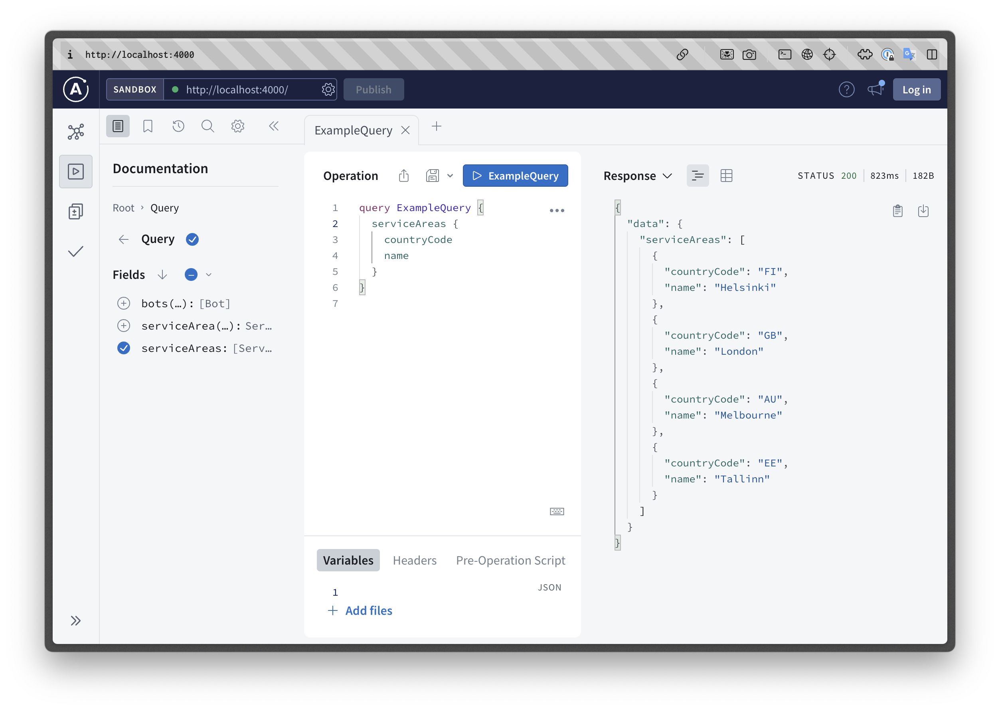

# Consuming GraphQL APIs

I made us a graphql server that runs inside this project so we can experiment with making an UI based on a GraphQL API. To get it 

- Checkout `add-grapql-server` branch
- Exit out of `npm run dev` command in your docker shell.
- `npm install`
- `npm run dev`

You should see more logs than before like below when you run `npm run dev`.

```bash
[server] 
[server] > webdevworkshop@0.0.0 server:dev
[server] > nodemon --watch src/server --ext ts,json --exec "vite-node src/server/server.ts"
[server] 
[frontend] 
[frontend] > webdevworkshop@0.0.0 frontend:dev
[frontend] > vite
[frontend] 
[server] [nodemon] 3.0.3
[server] [nodemon] to restart at any time, enter `rs`
[server] [nodemon] watching path(s): src/server/**/*
[server] [nodemon] watching extensions: ts,json
[server] [nodemon] starting `vite-node src/server/server.ts`
[frontend] 
[frontend]   VITE v5.0.12  ready in 187 ms
[frontend] 
[frontend]   ➜  Local:   http://localhost:8000/
[frontend]   ➜  Network: http://172.19.0.2:8000/
[server] Database does not exist
[server] Creating database schema...
[server] Seeding database...
[server] Inserting bots...
[server] Inserting service areas...
[server] Seeding Complete!
[server] GraphQL Server ready at: http://localhost:4000/
```

## About our graphql server and it's database.

I added another node script `npm run server:dev` that gets initiated when `npm run dev`. This is our new graphql server that runs on `localhost:4000`.

Implementation of the server code is out of this scope, that's why I won't go much into detail about how I put it together. But its code is in this repository at `src/server`, you can look at it in your time if you are interested.

But some here are some points about the server so you can troubleshoot if server behaves unexpectedly.

- Server uses local [SQLite](https://www.sqlite.org/index.html) as database. This is a file at the root of the repository `database.sqlite`.

- When server starts it will check if `database.sqlite` is present. Otherwise it will recreate it. If data goes stale. Delete it, then re run `npm run dev` to get it recreated.

- The tables and records in the database come from `src/server/server.seed.ts` file. You can see what's inserted into it from that file.

- Also you can browse the database tables by using any sqlite browser. If you don't have one already set up you can use [alpha.sqliteviewer.app](https://alpha.sqliteviewer.app). When you upload the `database.sqlite` file you'll see this. Click on the table names to see what's in them. You will need to re-upload when data changes.



## GraphQL server docs & sandbox.

We are using [Apollo](https://www.apollographql.com/docs/) as our GraphQL server. Which comes with a sandbox/browser/docs site.

Go to `http://localhost:4000` to view it.



We can write queries and mutations here which would run on our server. On the left side you write the queries. Right side you view the response. If you write multiple queries click on the query to activate one you want. Then click the play/run button.

## Implementing the query client to our web app.


