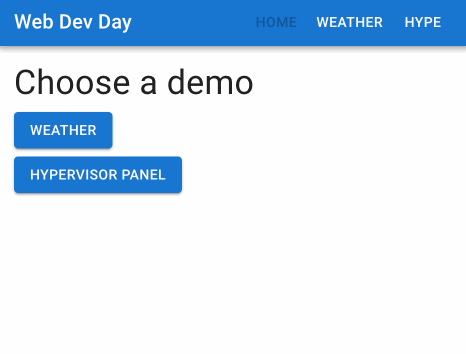

# Consuming GraphQL APIs

I made us a graphql server that runs inside this project so that we can experiment with making an UI based on a GraphQL API. To get it;

- Checkout `add-graphql-server` branch
- Exit out of `npm run dev` command in your docker shell.
- `npm install`
- `npm run dev`

You should see more logs than before, like below, when you run `npm run dev`:

```bash
[server]
[server] > webdevworkshop@0.0.0 server:dev
[server] > nodemon --watch src/server --ext ts,json --exec "vite-node src/server/server.ts"
[server]
[frontend]
[frontend] > webdevworkshop@0.0.0 frontend:dev
[frontend] > vite
[frontend]
[server] [nodemon] 3.0.3
[server] [nodemon] to restart at any time, enter `rs`
[server] [nodemon] watching path(s): src/server/**/*
[server] [nodemon] watching extensions: ts,json
[server] [nodemon] starting `vite-node src/server/server.ts`
[frontend]
[frontend]   VITE v5.0.12  ready in 187 ms
[frontend]
[frontend]   ➜  Local:   http://localhost:8000/
[frontend]   ➜  Network: http://172.19.0.2:8000/
[server] Database does not exist
[server] Creating database schema...
[server] Seeding database...
[server] Inserting bots...
[server] Inserting service areas...
[server] Seeding Complete!
[server] GraphQL Server ready at: http://localhost:4000/
```

## GraphQL language editor support

If you are on VS Code, you can install this extension from the GraphQL Foundation.
https://marketplace.visualstudio.com/items?itemName=GraphQL.vscode-graphql

## About our GraphQL server and it's database

I added another node script `npm run server:dev` that gets initiated when `npm run dev` is executed. This is our new graphql server that runs on `localhost:4000`.

Implementation of the server code is out of this scope, but you'll find the code in this repository at `src/server`. Have a look at it on your own time if you are interested.

Here are some points about the server for troubleshooting, if the server behaves unexpectedly.

- Server uses local [SQLite](https://www.sqlite.org/index.html) database. The DB is a file at the root of the repository `database.sqlite`.

- When the server starts it will check if `database.sqlite` is present. Otherwise it will recreate it. If the data goes stale, delete it and re run `npm run dev` to get it recreated.

- The tables and records in the database come from `src/server/server.seed.ts` file. You can see what's inserted into the DB from the file.

- You can also browse the database tables by using any sqlite browser. If you don't have one set up you can use [alpha.sqliteviewer.app](https://alpha.sqliteviewer.app). When you upload the `database.sqlite` file you'll see this. Click on the table names to see what's in them. You will need to re-upload when data changes.


## GraphQL server docs & sandbox.

We are using [Apollo](https://www.apollographql.com/docs/) as our GraphQL server. Which comes with a sandbox/browser/docs site.

Go to `http://localhost:4000` to view it.


We can write queries and mutations here which will run on our server. Queries are written on the left side and the right side is to view the response. If you write multiple queries, click on the query to activate the one you want. Then click the play/run button.

## Implementing the query client to our web app

Install the Apollo GraphQL client library:

`npm install @apollo/client graphql`

and make the following changes to `src/main.tsx`:

**src/main.tsx**

```diff
 import ReactDOM from "react-dom/client";
 import App from "./App.tsx";
 import { StyledEngineProvider } from "@mui/material/styles";
+import {
+  ApolloClient,
+  InMemoryCache,
+  ApolloProvider,
+  gql,
+} from "@apollo/client";
+
+const graphqlClient = new ApolloClient({
+  uri: "http://localhost:4000",
+  cache: new InMemoryCache(),
+});
+
+const queryResult = await graphqlClient.query({
+  query: gql`
+    query GetServiceAreas {
+      serviceAreas {
+        id
+        name
+      }
+    }
+  `,
+});
+
+console.log(queryResult.data);

 ReactDOM.createRoot(document.getElementById("root")!).render(
   <React.StrictMode>
```

Next, go to
`localhost:8000` and open the developer console to see the query result.


We ran this query and received its response. You can run the same query in `localhost:4000` as well.

```graphql
query GetServiceAreas {
  serviceAreas {
    id
    name
  }
}
```

Let's remove the hardcoded query in `main.tsx`, and see how we can query from React components. We will remove;

- the `gql` import.
- the query
- and the console.log

Wrap the `App` component with `ApolloClient` so that we can use the Apollo Client in react components:

**src/main.tsx**

```diff
 import ReactDOM from "react-dom/client";
 import App from "./App.tsx";
 import { StyledEngineProvider } from "@mui/material/styles";
-import {
-  ApolloClient,
-  InMemoryCache,
-  ApolloProvider,
-  gql,
-} from "@apollo/client";
+import { ApolloClient, InMemoryCache, ApolloProvider } from "@apollo/client";

 const graphqlClient = new ApolloClient({
   uri: "http://localhost:4000",
   cache: new InMemoryCache(),
 });

-const queryResult = await graphqlClient.query({
-  query: gql`
-    query GetServiceAreas {
-      serviceAreas {
-        id
-        name
-      }
-    }
-  `,
-});
-
-console.log(queryResult.data);
-
 ReactDOM.createRoot(document.getElementById("root")!).render(
   <React.StrictMode>
     <StyledEngineProvider injectFirst>
-      <App />
+      <ApolloProvider client={graphqlClient}>
+        <App />
+      </ApolloProvider>
     </StyledEngineProvider>
   </React.StrictMode>
 );
```

Next create a new page file `HypePage` at `src/pages/HypePage.tsx`:

**src/pages/HypePage.tsx**

```tsx
import {
  gql,
  useSuspenseQuery as useApolloSuspenseQuery,
} from "@apollo/client";
import Alert from "@mui/material/Alert/Alert";
import Paper from "@mui/material/Paper";
import Typography from "@mui/material/Typography";
import { Suspense } from "react";
import { ErrorBoundary } from "react-error-boundary";
import { ServiceArea } from "../generated/types/server";
import Box from "@mui/material/Box";

export default function HypePage() {
  return (
    <>
      <Typography variant="h4" component="h2">
        Hypervisor Panel
      </Typography>
      <ErrorBoundary
        fallbackRender={({ error }) => (
          <Alert severity="error">{error.message}</Alert>
        )}
      >
        <Suspense fallback={<div>Loading...</div>}>
          <Typography variant="h5" component="h3">
            Service Areas
          </Typography>
          <ServiceAreaList />
        </Suspense>
      </ErrorBoundary>
    </>
  );
}

function ServiceAreaList() {
  const {
    data: { serviceAreas },
  } = useApolloSuspenseQuery<{ serviceAreas: ServiceArea[] }>(
    AllServiceAreasQuery
  );
  return (
    <Paper
      sx={{
        display: "flex",
        flexDirection: "column",
        padding: 2,
      }}
    >
      <Box>{`id country name`}</Box>
      {serviceAreas.map((serviceArea) => (
        <Box key={serviceArea.id}>
          {`${serviceArea.id} ${serviceArea.countryCode} ${serviceArea.name}`}
        </Box>
      ))}
    </Paper>
  );
}

const AllServiceAreasQuery = gql`
  query AllServiceAreasQuery {
    serviceAreas {
      id
      countryCode
      name
    }
  }
`;
```

Several things happened here;

- We imported `useSuspenseQuery as useApolloSuspenseQuery` from `"@apollo/client"`. Normally we don't need to do this. This is to avoid confusion between React-Query's own `useSuspenseQuery`. Apollo Client comes with a very similar hook with React-Query and since they have the same name, to avoid confusion, I decided to alias `useSuspenseQuery as useApolloSuspenseQuery`.

- We created another component in the same file named `ServiceAreaList` and implemented the `useApolloSuspenseQuery` in it. Main reason is that `Suspense` and `ErrorBoundary` need to be handled by the parent of the component which produces either errors or a loading state.

- Apollo's `useSuspenseQuery` has the same behavior with React-Query so we implemented it the same way as our weather API calls from before. `ErrorBoundary` catches a thrown error and renders an `Alert` component from Material UI (MUI). While query is loading `Suspense` "Loading..." is shown as test for now.

- And finally we defined the query `AllServiceAreasQuery` which is the query we defined at `main.tsx`.

When we use Apollo Client with Typescript, we can call queries with specified types and Apollo Client will return values with the correct types. See our query hook implementation:

```ts
const {
  data: { serviceAreas },
} = useApolloSuspenseQuery<{ serviceAreas: ServiceArea[] }>(
  AllServiceAreasQuery
);
```

This part is the generic type definition `<{ serviceAreas: ServiceArea[] }>`. `ServiceArea` type comes from `import { ServiceArea } from "../generated/types/server";`.

I generated these types from the server GraphQL schema file `src/server/schema.graphql`. The logic of the generation goes beyond our scope, but do read more about it if you are interested.

We do this to use the same types in our frontend code as our server side.

Let's then add `HypePage` to `App.tsx` as a route at `/hype`:

**src/App.tsx**

```diff
 import WeatherPage from "./pages/WeatherPage";
 import NotFoundPage from "./pages/NotFoundPage";
 import PageLayout from "./components/PageLayout";
+import HypePage from "./pages/HypePage";

 const queryClient = new QueryClient();

          ...
           <Route path="/" element={<PageLayout />}>
             <Route index element={<HomePage />} />
             <Route path="weather" element={<WeatherPage />} />
+            <Route path="hype" element={<HypePage />} />
             <Route path="*" element={<NotFoundPage />} />
           </Route>
         </Routes>
```

Add a link from `HomePage.tsx` to `/hype` route:

**src/pages/HomePage.tsx**

```diff
   ...
       >
         Weather
       </Button>
+      <Button component={Link} to="/hype" variant="contained" color="primary">
+        Hypervisor Panel
+      </Button>
     </>
   );
 }
```

Next, we will add a link to the page header at `PageHeader.tsx` so we have a link to `/hype` from the header as well.

As we are here in `PageHeader.tsx` let's also keep track of which page we are at by showing the selected page as `disabled`, a visualization to make it appear grayed out. For example, when we are at the `/weather` page the `Weather` button will be disabled and when we go to another page `Weather` button gets re-enabled.

We will implement this using the `useLocation` hook and a `matchRoutes` utility from React-Router. By comparing the current browser URL location and finding the route it matches with, we can disable the matching navigation button.

Since we have 3 buttons now, the header title is squished a bit, so let's shorten the title text. Ideally we could swap the navigation buttons to a menu that reveals when clicked on an icon.

Also I missed to add a color style earlier, which introduced an issue which made buttons to seem disappearing in light mode. Let's fix that! We will add this missing `inherit` color to the `Buttons` so that their color changes along with the colorscheme.

**src/components/PageHeader.tsx**

```diff
 import Typography from "@mui/material/Typography";
 import Box from "@mui/material/Box";
 import Button from "@mui/material/Button";
-import { Link } from "react-router-dom";
+import { Link, matchRoutes, useLocation } from "react-router-dom";

 const menuItems: { title: string; path: string }[] = [
   { title: "Home", path: "/" },
   { title: "Weather", path: "/weather" },
+  { title: "Hype", path: "/hype" },
 ];

 export default function PageHeader() {
+  const location = useLocation();
+  const matchingRoutes = matchRoutes(menuItems, location);
+  const matchingRoutePath = matchingRoutes?.[0]?.route?.path;
+
   return (
     <AppBar position="static">
       <Toolbar>
             ...
             flexGrow: 1,
           }}
         >
-          Starship Web Dev Workshop
+          Web Dev Day
         </Typography>
         <Box>
           {menuItems.map((item) => (
-            <Button component={Link} to={item.path} key={item.title}>
+            <Button
+              component={Link}
+              to={item.path}
+              key={item.title}
+              disabled={item.path === matchingRoutePath}
+              sx={{ color: "inherit" }}
+            >
               {item.title}
             </Button>
           ))}
```

Now if you go to `localhost:8000` you should be able to go to `/hype` page and the see menu buttons change according to the active page, like so;



Let's see what happens if we make a bad request that GraphQL doesn't accept. For example, change the query and add a value that ServiceArea doesn't have.

**src/pages/HypePage.tsx**

```diff
 const AllServiceAreasQuery = gql`
   query AllServiceAreasQuery {
     serviceAreas {
       id
       countryCode
       name
+      pizza
     }
   }
 `;
```

Then go back to `localhost:8000/hype` and click the menu button or the button at homepage to go to `/hype` page.

You should see that an error was handled by the `ErrorBoundary`.


ServiceAreas doesn't have pizza :(

When you check your browsers network console and locate the `400` error code at the `localhost:4000` request, you can see the error in more detail from the request that was rejected.


