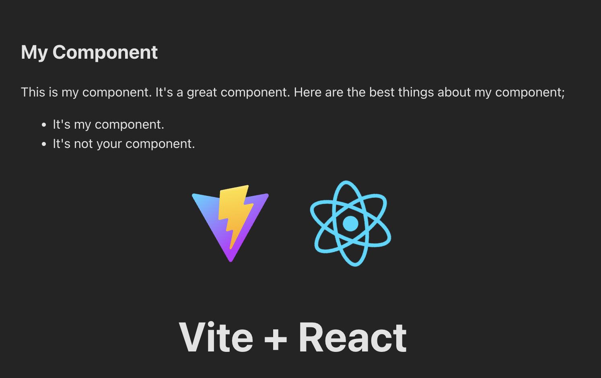

## Create a new component

React has a very good documentation page at [react.dev](https://react.dev). If you want to learn more in detail you can check there later. In this workshow let's dive in and learn by experimenting.

Let's create our first component. React is all about building blocks aka components. You can either use components others created or make your own. We can choose from React-dom's own primitives or we can install 3rd party dependencies from npm. Let's try to make our own.

Create a "components" folder under "src" then create file "MyComponent.tsx" in it.
Then copy paste this code inside it

**src/components/MyComponent.tsx**
```tsx
export default function MyComponent() {
  return (
    <div style={{ textAlign: "left" }}>
      <h2>My Component</h2>
      <p>
        This is my component. It's a great component. Here are the best things
        about my component;
      </p>
      <ul>
        <li>It's my component.</li>
        <li>It's not your component.</li>
      </ul>
    </div>
  );
}
```

open `src/App.tsx` and add this line under the last import.
`import MyComponent, { MyComponentWithoutJsx } from "./components/MyComponent";`

.ts extension is for typescript.

.tsx extension is for typescript with jsx. (we'll see what jsx is soon)

```diff
...
import "./App.css";
+ import MyComponent, { MyComponentWithoutJsx } from "./components/MyComponent";

function App() {
...
```

Then let's display your component. Add this line between opening of the first `div` and first `a` anchor tag.

```diff
function App() {
  const [count, setCount] = useState(0);

  return (
    <>
      <div>
+       <MyComponent />
        <a href="https://vitejs.dev" target="_blank">
```

This adds your component into main "App" component's layout. Save all the changes then check the development page [localhost:8000](http://localhost:8000). You should see this;

 

The html looking syntax in your `MyComponent.tsx` file is called JSX. You can learn more about it [here](https://legacy.reactjs.org/docs/introducing-jsx.html). Basically it is a way to create and compose elements using a familiar syntax.

Without using jsx we could write the same layout like this. By using only react itself.

```ts
import React from "react";

export default function MyComponentWithoutJsx() {
  return React.createElement(
    "div",
    { style: { textAlign: "left" } },
    React.createElement("h2", {}, "My Component without jsx"),
    React.createElement(
      "p",
      {},
      "This is my component. It's a great component. Here are the best things about my component;"
    ),
    React.createElement(
      "ul",
      {},
      React.createElement("li", {}, "It's my component."),
      React.createElement("li", {}, "It's not your component.")
    )
  );
}
```

We use couple tools called a bundler and a transpiler to turn jsx from before into the code above automatically.
The bundler we use in this project is [Vite](https://vitejs.dev/).
And the transpiler is [SWC](https://swc.rs/).

Transpiler transforms jsx and typescript into javascript so that browser can understand it. Bundler allows us to use the transpiler and run a development server, re-run when we save files, put together all the files and dependencies we used so that we can deploy our web app etc.

See `package.json` file for all the tools we use from npm
