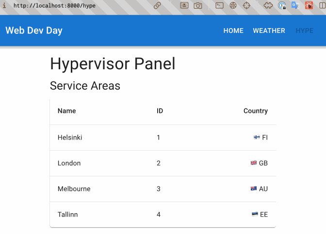
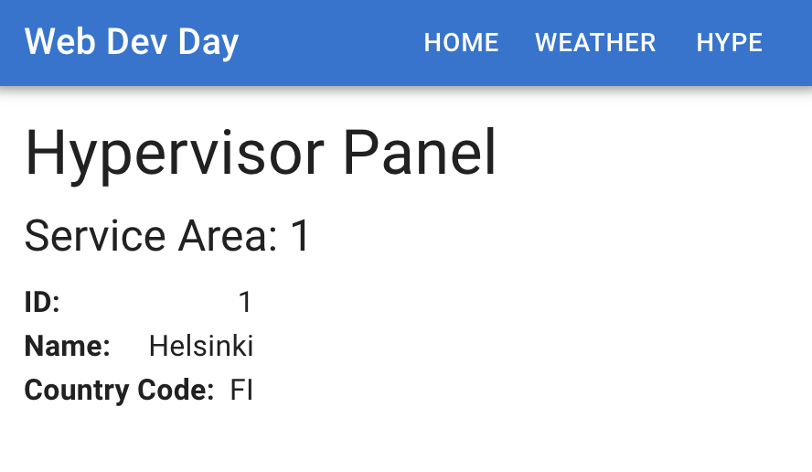

# Detail pages & route parameters

In this section we will be adding a detail page for the service areas.

## Adding a service area detail page

Change the `onClick` callback handler from `CommonDataTable` of `ServiceAreaList` so that it goes to path `/hype/service-area/1` if the clicked service area id is 1:

**src/components/ServiceAreaList.tsx**

```diff
 import { ServiceArea } from "../generated/types/server";
 import { CommonDataTable } from "./CommonDataTable";
+import { useNavigate } from "react-router-dom";

 const TableColumnHeaders = ["Name", "ID", "Country"];

     ...
     AllServiceAreasQuery
   );

+  const navigate = useNavigate();
+
   return (
     <CommonDataTable
-      onRowClicked={(a) => console.log(a.name)}
+      onRowClicked={(area) => navigate(`/hype/service-area/${area.id}`)}
       rows={serviceAreas}
       columnHeaders={TableColumnHeaders}
       cellsForRow={(serviceArea) => ({
```

We need to add a route and a page component for handling this new `/hype/service-area/:id` path. Let's change `HypePage` similarly to `PageLayout` as a nested route structure so that we have the same layout for every page under the `/hype` path.

We will also create a new page `ServiceAreasPage` to be the index page of `/hype`, moving the table components from `HypePage` into the `ServiceAreas` page.

The `:id` portion in `/hype/service-areas/:id` means that it is a path parameter (we will be able to get the value in `ServiceAreaDetail` page component later):

**src/App.tsx**

```diff
 ...
 import NotFoundPage from "./pages/NotFoundPage";
 import PageLayout from "./components/PageLayout";
 import HypePage from "./pages/HypePage";
+import ServiceAreasPage from "./pages/ServiceAreasPage";
+import ServiceAreaDetailPage from "./pages/ServiceAreaDetailPage";

 const queryClient = new QueryClient();

           ...
           <Route path="/" element={<PageLayout />}>
             <Route index element={<HomePage />} />
             <Route path="weather" element={<WeatherPage />} />
-            <Route path="hype" element={<HypePage />} />
+            <Route path="hype/" element={<HypePage />}>
+              <Route index element={<ServiceAreasPage />} />
+              <Route
+                path="service-area/:id"
+                element={<ServiceAreaDetailPage />}
+              />
+            </Route>
             <Route path="*" element={<NotFoundPage />} />
           </Route>
         </Routes>

```

Next, we create the `HypePage` page component.

We'll replace the table components with `<Outlet />` so that children of the `/hype` path can inject their own elements.

We can also turn `HypePage` title into a link so that clicking it would go to `/hype`. Similar to what we did with at the App header title, clicking it takes a user to `/`.

**src/pages/HypePage.tsx**

```diff
 ...
-import Alert from "@mui/material/Alert/Alert";
 import Typography from "@mui/material/Typography";
-import { Suspense } from "react";
-import { ErrorBoundary } from "react-error-boundary";
-import ServiceAreaList from "../components/ServiceAreaList";
+import { Link, Outlet } from "react-router-dom";

 export default function HypePage() {
   return (
     <>
-      <Typography variant="h4" component="h2">
+      <Typography
+        component={Link}
+        to="/hype"
+        variant="h4"
+        sx={{
+          textDecoration: "none",
+          color: "inherit",
+          flexGrow: 1,
+        }}
+      >
         Hypervisor Panel
       </Typography>
-      <Typography variant="h5" component="h3">
-        Service Areas
-      </Typography>
-      <ErrorBoundary
-        fallbackRender={({ error }) => (
-          <Alert severity="error">{error.message}</Alert>
-        )}
-      >
-        <Suspense fallback={<ServiceAreaList.Skeleton />}>
-          <ServiceAreaList />
-        </Suspense>
-      </ErrorBoundary>
+      <Outlet />
     </>
   );
 }
```

Then, create the `ServiceAreasPage` page component.

Nothing much special going here. We pretty much only moved code from `HypePage` to here:

**src/pages/ServiceAreasPage.tsx**

```tsx
import Alert from "@mui/material/Alert/Alert";
import Typography from "@mui/material/Typography";
import { Suspense } from "react";
import { ErrorBoundary } from "react-error-boundary";
import ServiceAreaList from "../components/ServiceAreaList";

export default function ServiceAreasPage() {
  return (
    <>
      <Typography variant="h5" component="h3">
        Service Areas
      </Typography>
      <ErrorBoundary
        fallbackRender={({ error }) => (
          <Alert severity="error">{error.message}</Alert>
        )}
      >
        <Suspense fallback={<ServiceAreaList.Skeleton />}>
          <ServiceAreaList />
        </Suspense>
      </ErrorBoundary>
    </>
  );
}
```

Finally create the `ServiceAreaDetailPage` page component so that we handle the path `/hype/service-areas/:id`:

**src/pages/ServiceAreaDetailsPage.tsx**

```tsx
import Typography from "@mui/material/Typography";
import { useParams } from "react-router-dom";

export default function ServiceAreaDetailPage() {
  const { id: serviceAreaId } = useParams();

  return (
    <>
      <Typography variant="h5" component="h3">
        Service Area: {serviceAreaId}
      </Typography>
    </>
  );
}
```

We get the value of `:id` in `/hype/service-areas/:id` path using `const { id: serviceAreaId } = useParams();` hook from React Router. Then we show the ID in the layout next to the title.

Now you can go to `localhost:8000/hype` to test our changes.



Let's show the details of the service area in `ServiceAreaDetailPage` as well. We will see how we can add parameters to GraphQL queries while doing this.

First let's make a key-value pair display component that we can re-use. Let's call it `TitleValueRow`:

**src/components/TitleValueRow.tsx**

```tsx
import { Typography } from "@mui/material";
import Box from "@mui/material/Box";

export default function TitleValueRow({
  title,
  value,
}: {
  title: string;
  value: React.ReactNode;
}) {
  return (
    <Box
      sx={{
        display: "flex",
        flexDirection: "row",
        alignItems: "center",
        justifyContent: "space-between",
        gap: 1,
      }}
    >
      <Typography sx={{ fontWeight: "bold" }}>{title}:</Typography>
      <Typography>{value}</Typography>
    </Box>
  );
}
```

Then make a `ServiceAreaDetails` component. We will fetch service area data from GraphQL API with service area's id:

**src/components/ServiceAreaDetails.tsx**

```tsx
import { gql, useSuspenseQuery } from "@apollo/client";
import Box from "@mui/material/Box";
import { ServiceArea } from "../generated/types/server";
import TitleValueRow from "./TitleValueRow";

export default function ServiceAreaDetails({ id }: { id?: string }) {
  if (!id) {
    throw new Error("Unknown service area ID");
  }

  const {
    data: { serviceArea },
  } = useSuspenseQuery<{ serviceArea: ServiceArea }>(ServiceAreaDetailsQuery, {
    variables: { id },
  });

  return (
    <Box sx={{ display: "flex", flexDirection: "column", flex: 1 }}>
      <TitleValueRow title="ID" value={serviceArea.id} />
      <TitleValueRow title="Name" value={serviceArea.name} />
      <TitleValueRow title="Country Code" value={serviceArea.countryCode} />
    </Box>
  );
}

const ServiceAreaDetailsQuery = gql`
  query ServiceAreaDetailsQuery($id: ID!) {
    serviceArea(id: $id) {
      id
      name
      countryCode
    }
  }
`;
```

And finally, use the `ServiceAreaDetails` component in the `ServiceAreaDetailPage` page component `ServiceAreaDetailPage`.

We won't make a skeleton component for the loading state in this case, as we have seen how to make those before in `ServiceAreasPage`.

Similar to other pages before, we wrap the `ServiceAreaDetails` component with `ErrorBoundary` and `Suspense`, only difference is that `ServiceAreaDetails` takes the service area `id` as prop:

**src/components/ServiceAreaDetailPage.tsx**

```diff
 ...
 import Typography from "@mui/material/Typography";
 import { useParams } from "react-router-dom";
+import ServiceAreaDetails from "../components/ServiceAreaDetails";
+import { Suspense } from "react";
+import { ErrorBoundary } from "react-error-boundary";
+import Alert from "@mui/material/Alert";

 export default function ServiceAreaDetailPage() {
   const { id: serviceAreaId } = useParams();
       ...
       <Typography variant="h5" component="h3">
         Service Area: {serviceAreaId}
       </Typography>
+      <ErrorBoundary
+        fallbackRender={({ error }) => (
+          <Alert severity="error">{error.message}</Alert>
+        )}
+      >
+        <Suspense fallback={<>loading...</>}>
+          <ServiceAreaDetails id={serviceAreaId} />
+        </Suspense>
+      </ErrorBoundary>
     </>
   );
 }
```

Now you should see the service area details showing at `localhost:8000/hype/service-area/1`


