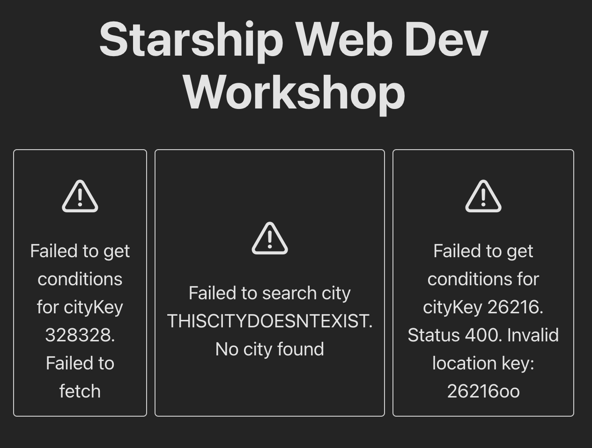
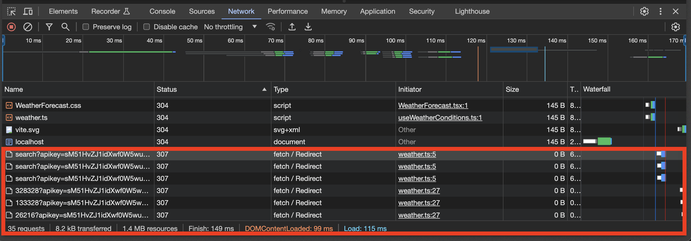

# Error handling and caching

We have few issues with our implementation.
- We have double `useEffect` calls because of react's development only strict mode
- We fetch data every time, could keep it in memory for a bit to avoid excessive calls
- We don't handle the errors if something wrong happens while fetching the weather conditions
- We have API keys hardcoded into our code. Which will end up in repository. We shouldn't leak keys.

## Setting up environment variables

Let's setup environment variables so that we don't have to hardcode api keys. We can keep them in a `.env` file and exclude it from git repository.

create a .env file at the root of the project. And put your accuweather api key here.

**.env**
```
VITE_ACCUWEATHER_API_KEY=YOURAPIKEYHERE
```

We need to also prevent this file from getting checked to git. So we should add `.env` to our `.gitignore`

**.gitignore**
```diff
  ...
  *.njsproj
  *.sln
  *.sw?
  
+ .env
```

VITE_ prefix is an indication for vite bundler to include this as a constant in frontend code. Normally we would keep this in the server and not leak the api key to frontend. If we'd omit the VITE_ prefix frontend code won't have access to the key or the value.

We will later setup a nodejs api server and make api calls to weather service from there so this is a temporary step.

Vite loads environment variables and exposes them so we can access like this

```tsx
import.meta.env.VITE_ACCUWEATHER_API_KEY
```

let's update `useWeatherConditions.ts` to read api key from .env file there

**src/hooks/useWeatherConditions.tsx**

```diff
  ...
  export default function useWeatherConditions(city: string) {
    const [weatherText, setWeatherText] = useState<string | null>(null);
    const [weatherIcon, setWeatherIcon] = useState<string | null>(null);
    const [temperature, setTemperature] = useState<number | null>(null);
    const [loading, setLoading] = useState(false);

    const reload = useCallback(async () => {
      setLoading(true);

      const citySearchResponse = await fetch(
-       `http://dataservice.accuweather.com/locations/v1/cities/search?apikey=YOURAPIKEY&q=${city}`
+       `http://dataservice.accuweather.com/locations/v1/cities/search?apikey=${
+         import.meta.env.VITE_ACCUWEATHER_API_KEY
+       }&q=${city}`
      );
      const citySearchData = await citySearchResponse.json();
      const cityKey = citySearchData?.[0]?.Key;

      const weatherConditionsResponse = await fetch(
-       `http://dataservice.accuweather.com/currentconditions/v1/${cityKey}?apikey=YOURAPIKEY`
+       `http://dataservice.accuweather.com/currentconditions/v1/${cityKey}?apikey=${
+         import.meta.env.VITE_ACCUWEATHER_API_KEY
        }`
      );

      ...
```

Try going to `localhost:8000` to see if everything works as before.

## Adding react-query

About the issues with the queries and error handling.
We can solve it by implementing the tool [react-query](https://tanstack.com/query/latest) 

in your terminal exit vite process (ctrl + c)
(remember to use the docker shell if you have been working in it)

install react-query

```bash
npm i @tanstack/react-query

```
install it's linter extensions as well

```bash
npm i -D @tanstack/eslint-plugin-query
```

start vite development server again

```bash
npm run dev
```

We will need to setup `react-query`s `QueryClient` in our code so it can work.

open `App.tsx` and make these changes

**src/App.tsx**

```diff
+ import { QueryClient, QueryClientProvider } from "@tanstack/react-query";
  import "./App.css";
  import CityWeatherContainer from "./components/CityWeatherContainer";
  
  const queryClient = new QueryClient();
  
  function App() {
    return (
+     <QueryClientProvider client={queryClient}>
        <>
          <h1>Starship Web Dev Workshop</h1>
          <div className="forecasts-container">
            <CityWeatherContainer city="London" />
            <CityWeatherContainer city="Helsinki" />
            <CityWeatherContainer city="Melbourne" />
          </div>
        </>
+     </QueryClientProvider>
    );
  }
  
  export default App;
```

Now that it's set up, let's clean up the weather service implementation using `react-query`

Move weather api related code from `src/hooks/useWeatherConditions.ts` into `src/services/weather.ts`. And add some error handling

**src/services/weather.ts**

```ts
const ACCUWEATHER_API_URL = "http://dataservice.accuweather.com";

export async function searchCity(city: string) {
  try {
    const response = await fetch(
      `${ACCUWEATHER_API_URL}/locations/v1/cities/search?apikey=${
        import.meta.env.VITE_ACCUWEATHER_API_KEY
      }&q=${city}`
    );
    const data = await response.json();
    if (!response.ok) {
      throw new Error(`Status ${response.status}. ${data.Message}`);
    }
    if (data.length === 0) {
      throw new Error(`No city found`);
    }
    return data;
  } catch (error) {
    if (error instanceof Error) {
      throw new Error(`Failed to search city ${city}. ${error.message}`);
    }
  }
}

export async function getWeatherConditions(cityKey: string) {
  try {
    const response = await fetch(
      `${ACCUWEATHER_API_URL}/currentconditions/v1/${cityKey}?apikey=${
        import.meta.env.VITE_ACCUWEATHER_API_KEY
      }`
    );
    const data = await response.json();
    if (!response.ok) {
      throw new Error(`Status ${response.status}. ${data.Message}`);
    }
    return data;
  } catch (error) {
    if (error instanceof Error) {
      throw new Error(
        `Failed to get conditions for cityKey ${cityKey}. ${error.message}`
      );
    }
  }
}
```

And then call these functions from `useWeatherConditions`

**src/hooks/useWeatherConditions.ts**

```tsx
import * as WeatherApi from "../services/weather";
import { useQuery } from "@tanstack/react-query";

export default function useWeatherConditions(city: string) {
  const citySearchQuery = useQuery({
    queryKey: ["search-city", city],
    queryFn: () => WeatherApi.searchCity(city),
  });

  const citySearchData = citySearchQuery.data;
  const cityKey = citySearchData?.[0]?.Key;

  const weatherConditionsQuery = useQuery({
    queryKey: ["weather-conditions", cityKey],
    queryFn: () => WeatherApi.getWeatherConditions(cityKey),
    enabled: Boolean(cityKey),
  });

  const weatherConditionsData = weatherConditionsQuery.data;
  const weatherText = weatherConditionsData?.[0]?.WeatherText;
  const weatherIcon = weatherConditionsData?.[0]?.WeatherIcon;
  const temperature = weatherConditionsData?.[0]?.Temperature?.Metric?.Value;

  const reload = () => {
    citySearchQuery.refetch();
    weatherConditionsQuery.refetch();
  };
  const loading = citySearchQuery.isLoading || weatherConditionsQuery.isLoading;
  const error = citySearchQuery.error || weatherConditionsQuery.error;

  return {
    weatherText,
    weatherIcon,
    temperature,
    loading,
    error,
    reload,
  };
}
```

There is several things happening here;

- we removed api calls and wrapped them with `useQuery` from `react-query`
- gave them caching keys `["search-city", city]` and `["weather-conditions", cityKey]` so that calls with particular parameters get cached for 5 minutes (by default)
- automatic retry, when query's fail for some reason `useQuery` will retry them.
- removed loading state and reimplemented using loading states of queries
- we gathered and returned the errors from query's
- we enable weather conditions query conditionally with `enabled: Boolean(cityKey)`. Because we don't want it to trigger for no reason when we don't have a valid `cityKey` 
- removed `useEffect` hook we used just to load data automatically. `useQuery` will fetch the queries automatically by default.

Then let's implement our new `error` property that we returned into `CityWeatherContainer` component

Start by making a error display component. Create `src/components/WeatherForecastError.tsx`

**src/components/WeatherForecastError.tsx**

```tsx
type WeatherForecastErrorProps = {
  message: string;
};

export default function WeatherForecastError({
  message,
}: WeatherForecastErrorProps) {
  return (
    <div className="weather-forecast">
      <div className="weather-forecast-icon">⚠️</div>
      <div className="weather-forecast-title">{message}</div>
    </div>
  );
}
```

Then implement it in `src/components/CityWeatherContainer.tsx`

**src/components/CityWeatherContainer.tsx**
```diff
  ...
  export default function CityWeatherContainer({
    city,
  }: CityWeatherContainerProps) {
    const { reload, weatherIcon, weatherText, temperature, loading, error } =
      useWeatherConditions(city);
  
+   if (error) {
+     return <WeatherForecastError message={error.message} />;
+   }
  
    if (loading) {
      return <WeatherForecastLoading />;
    }
  
    return (
      <WeatherForecast
        city={city}
  ...
```

Let's check `localhost:8000` to see if we see any errors already.

If you haven't run out of your api call limit already, and have no errors showing. Let's cause an error on purpose to test the handled error display.

in `App.tsx` temporarily change a city name to a city that doesn't exist. So that api call fails.

**src/App.tsx**

```diff
  ...
          <CityWeatherContainer city="London" />
-         <CityWeatherContainer city="Helsinki" />
+         <CityWeatherContainer city="THISCITYDOESNTEXIST" />
          <CityWeatherContainer city="Melbourne" />
  ...
```



When you revert the change you should see weather conditions normally. If you still see errors, try renewing you api key by deleting & recreating the accuweather app. 

Also if you open developer console of your browser and refresh the page. You should see exactly 6 api calls made, like we expected before. Unless queries failed and got retried.

`react-query` is aware of React strict mode's behavior. Also deduplicates queries happen too soon back to back to avoid excessive calls.



## Suspense and Error boundaries

We deleted a lot of code from `useWeatherConditions` hook. I think we can delete even more.

We will use react's one of the newest features called "Suspense". [React Suspense](https://react.dev/reference/react/Suspense) allows us to track automatically if an underlying component is busy with some asynchronous task. Which is perfect for our case which is data fetching.

This will allow us to stop passing around loading and error state information around and have it automatically handled from parent component `CityWeatherContainer` of its child `WeatherForecast`.

`react-query` is also compatible with Suspense. So we can easily turn our `useQuery` calls into `useSuspenseQuery` calls.

let's start changing from `useWeatherConditions.ts`

**src/hooks/useWeatherConditions.ts**
```diff
  import * as WeatherApi from "../services/weather";
- import { useQuery } from "@tanstack/react-query";
+ import { useSuspenseQuery } from "@tanstack/react-query";
 
  export default function useWeatherConditions(city: string) {
-   const citySearchQuery = useQuery({
+   const citySearchQuery = useSuspenseQuery({
      queryKey: ["search-city", city],
      queryFn: () => WeatherApi.searchCity(city),
    });
    const citySearchData = citySearchQuery.data;
    const cityKey = citySearchData?.[0]?.Key;
 
-   const weatherConditionsQuery = useQuery({
+   const weatherConditionsQuery = useSuspenseQuery({
      queryKey: ["weather-conditions", cityKey],
-     queryFn: () => WeatherApi.getWeatherConditions(cityKey),
-     enabled: Boolean(cityKey),
+     queryFn: () => {
+       if (!cityKey) {
+         return null;
+       }
+       return WeatherApi.getWeatherConditions(cityKey);
+     },
    });
 
    const weatherConditionsData = weatherConditionsQuery.data;
    const weatherIcon = weatherConditionsData?.[0]?.WeatherIcon;
    const temperature = weatherConditionsData?.[0]?.Temperature?.Metric?.Value;
 
-   const reload = () => {
-     citySearchQuery.refetch();
-     weatherConditionsQuery.refetch();
-   };
-   const loading = citySearchQuery.isLoading || weatherConditionsQuery.isLoading;
-   const error = citySearchQuery.error || weatherConditionsQuery.error;
-
    return {
      weatherText,
      weatherIcon,
      temperature,
-     loading,
-     error,
-     reload,
    };
  }
```

so we will end up with;
**src/hooks/useWeatherConditions.ts**

```tsx
import * as WeatherApi from "../services/weather";
import { useSuspenseQuery } from "@tanstack/react-query";

export default function useWeatherConditions(city: string) {
  const citySearchQuery = useSuspenseQuery({
    queryKey: ["search-city", city],
    queryFn: () => WeatherApi.searchCity(city),
  });

  const citySearchData = citySearchQuery.data;
  const cityKey = citySearchData?.[0]?.Key;

  const weatherConditionsQuery = useSuspenseQuery({
    queryKey: ["weather-conditions", cityKey],
    queryFn: () => {
      if (!cityKey) {
        return null;
      }
      return WeatherApi.getWeatherConditions(cityKey);
    },
  });

  const weatherConditionsData = weatherConditionsQuery.data;
  const weatherText = weatherConditionsData?.[0]?.WeatherText;
  const weatherIcon = weatherConditionsData?.[0]?.WeatherIcon;
  const temperature = weatherConditionsData?.[0]?.Temperature?.Metric?.Value;

  return {
    weatherText,
    weatherIcon,
    temperature,
  };
}
```

Let's move `useWeatherConditions` hook into `WeatherForecast` and remove the unused `onClick` handler. It will not need `temperature` and other props neither because we can now get them from the query response so let's remove them.

**src/components/WeatherForecastProps.tsx**

```diff
+import useWeatherConditions from "../hooks/useWeatherConditions";
 import "./WeatherForecast.css";
 
 type WeatherForecastProps = {
   city: string;
-  temperature: number | null;
-  description: string | null;
-  icon: string | null;
-  onClick: (city: string) => void;
 };
 
 export default function WeatherForecast(props: WeatherForecastProps) {
-  const handleOnClick = () => {
-    props.onClick(props.city);
-  };
+  const { weatherIcon, weatherText, temperature } = useWeatherConditions(
+    props.city
+  );
+
   return (
-    <div className="weather-forecast" onClick={handleOnClick}>
+    <div className="weather-forecast">
       <div className="weather-forecast-title">Weather in {props.city}</div>
-      <div className="weather-forecast-icon">{props.icon ?? "️🤷‍♀️"}</div>
+      <div className="weather-forecast-icon">{weatherIcon ?? "️🤷‍♀️"}</div>
       <div className="weather-forecast-value">
-        {props.temperature ?? "🤔"}°C {props.description ?? "🤷‍♂️"}
+        {temperature ?? "🤔"}°C {weatherText ?? "🤷‍♂️"}
       </div>
     </div>
   );
```

So resulting `WeatherForecastProps` will be;

**src/components/WeatherForecastProps.tsx**
```tsx
import useWeatherConditions from "../hooks/useWeatherConditions";
import "./WeatherForecast.css";

type WeatherForecastProps = {
  city: string;
};

export default function WeatherForecast(props: WeatherForecastProps) {
  const { weatherIcon, weatherText, temperature } = useWeatherConditions(
    props.city
  );

  return (
    <div className="weather-forecast">
      <div className="weather-forecast-title">Weather in {props.city}</div>
      <div className="weather-forecast-icon">{weatherIcon ?? "️🤷‍♀️"}</div>
      <div className="weather-forecast-value">
        {temperature ?? "🤔"}°C {weatherText ?? "🤷‍♂️"}
      </div>
    </div>
  );
}
```

Finally we need to modify `CityWeatherContainer` to implement `Suspense` and `ErrorBoundaries`.

First install `react-error-boundaries` module so we can use a reusable error boundary. Otherwise we'd need to do a [custom boundary implementation](https://react.dev/reference/react/Component#catching-rendering-errors-with-an-error-boundary). Which is not too difficult but `react-error-boundaries` module handles more edge cases and more reusable, allows custom fallback ui as well.

Run this in your terminal. and remember to restart the vite dev server after

```bash
npm i react-error-boundary
```

now we can add it to `CityWeatherContainer`

**src/components/CityWeatherContainer**

```diff
-import useWeatherConditions from "../hooks/useWeatherConditions";
+import { Suspense } from "react";
 import WeatherForecast from "./WeatherForecast";
-import WeatherForecastError from "./WeatherForecastError";
 import WeatherForecastLoading from "./WeatherForecastLoading";
+import { ErrorBoundary } from "react-error-boundary";
+import WeatherForecastError from "./WeatherForecastError";
 
 type CityWeatherContainerProps = {
   city: string;
@@ -10,24 +11,15 @@ type CityWeatherContainerProps = {
 export default function CityWeatherContainer({
   city,
 }: CityWeatherContainerProps) {
-  const { reload, weatherIcon, weatherText, temperature, loading, error } =
-    useWeatherConditions(city);
-
-  if (error) {
-    return <WeatherForecastError message={error.message} />;
-  }
-
-  if (loading) {
-    return <WeatherForecastLoading />;
-  }
-
   return (
-    <WeatherForecast
-      city={city}
-      temperature={temperature}
-      description={weatherText}
-      icon={weatherIcon}
-      onClick={reload}
-    />
+    <ErrorBoundary
+      fallbackRender={({ error }) => (
+        <WeatherForecastError message={error.message} />
+      )}
+    >
+      <Suspense fallback={<WeatherForecastLoading />}>
+        <WeatherForecast city={city} />
+      </Suspense>
+    </ErrorBoundary>
   );
 }
```

so it will much more concise like this;

**src/components/CityWeatherContainer**

```tsx
import { Suspense } from "react";
import WeatherForecast from "./WeatherForecast";
import WeatherForecastLoading from "./WeatherForecastLoading";
import { ErrorBoundary } from "react-error-boundary";
import WeatherForecastError from "./WeatherForecastError";

type CityWeatherContainerProps = {
  city: string;
};

export default function CityWeatherContainer({
  city,
}: CityWeatherContainerProps) {
  return (
    <ErrorBoundary
      fallbackRender={({ error }) => (
        <WeatherForecastError message={error.message} />
      )}
    >
      <Suspense fallback={<WeatherForecastLoading />}>
        <WeatherForecast city={city} />
      </Suspense>
    </ErrorBoundary>
  );
}
```

After these changes our web app should work just as before but with much less code. You can try to change one of the city names to trigger an error.