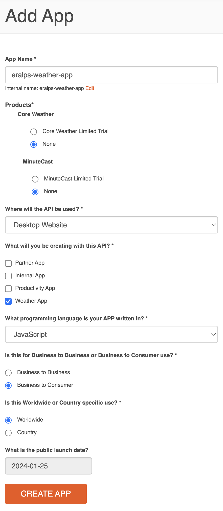
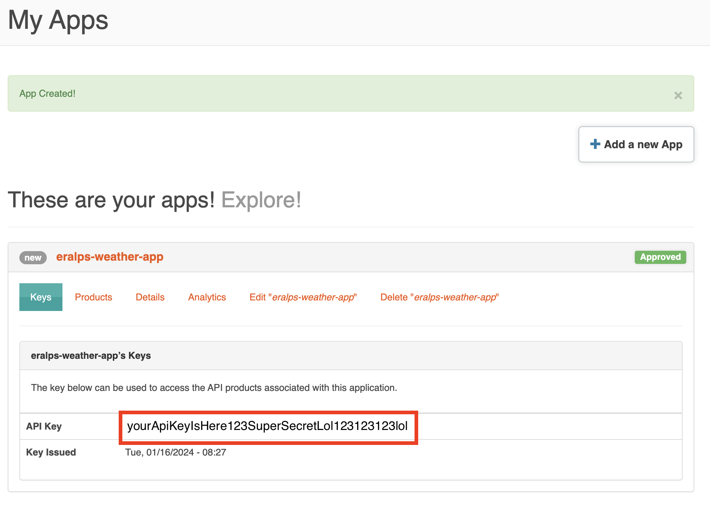
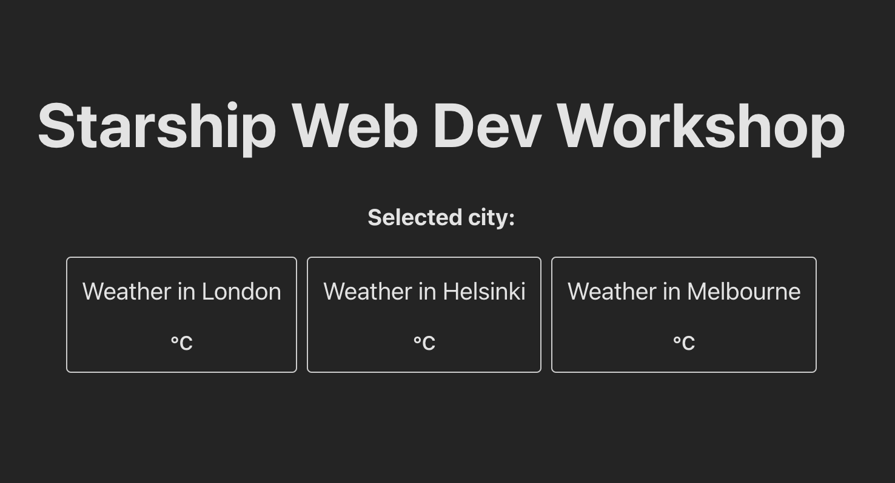
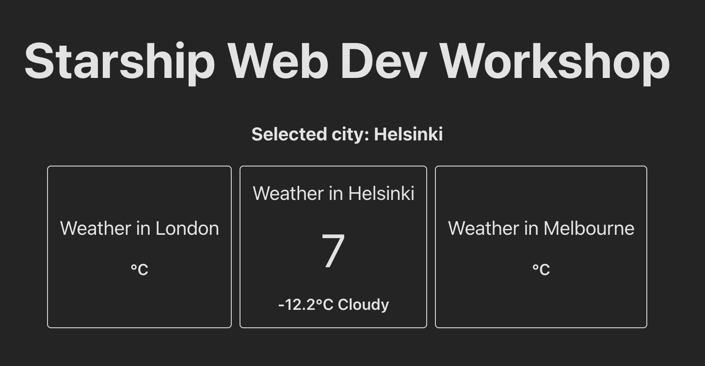
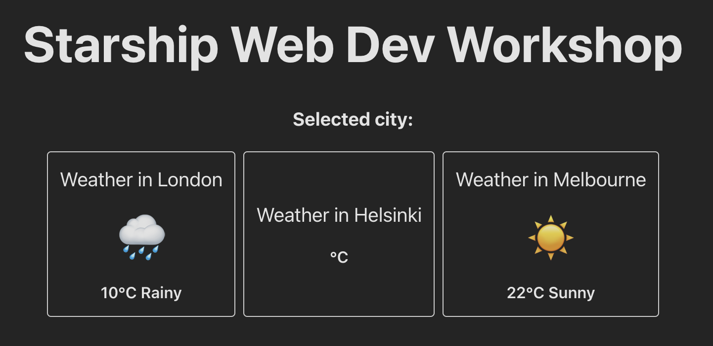
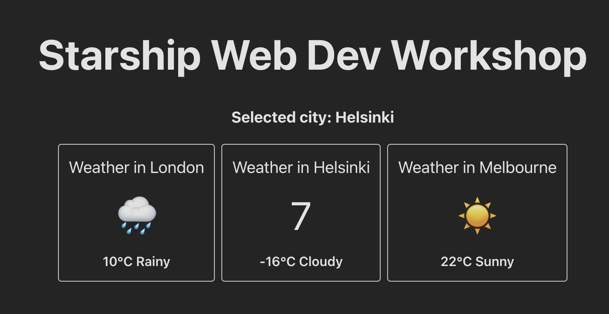
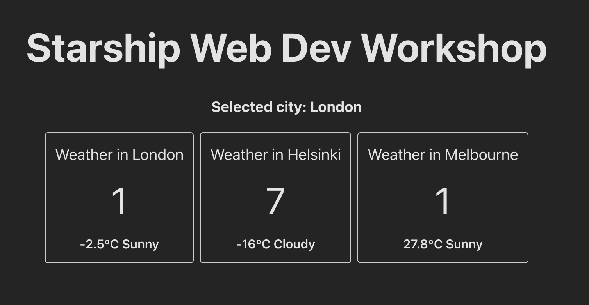

# Fetching Live Data

Let's make our web app actually useful by fetching some live data

## Accuweather API

We will use accuweather's API to search for a city and get its current weather conditions.

- get your api key from https://developer.accuweather.com/
- click register at the top right
- then click my apps or go to https://developer.accuweather.com/user/me/apps
- click add a new app

Here's the options we should choose. I recommend turning off the trials.



Once you've clicked "create app" you should see your newly created app. Click on it to reveal the api key.



Let's first try to get some live weather data using curl. Run this command in your terminal but remember to change `REPLACETHISWITHYOURAPIKEY` with your own api key from the Accuweather page:

```bash
curl -X GET "http://dataservice.accuweather.com/locations/v1/cities/search?apikey=REPLACETHISWITHYOURAPIKEY&q=tallinn"
```

This api endpoint searches for cities. We need the city `Key` value in order to fetch a weather forecast for a specific location from the api. You should see a response like this:

```bash
[{"Version":1,"Key":"127964","Type":"City","Rank":30,"LocalizedName":"Tallinn", ...
```

The City key for Tallinn is 127964. If you searched another city take a note of it's key somewhere.

Let's then fetch the weather forecast. Run this command in the terminal replacing the api key like we did before. If you searched for a different city, also replace the `Key` value to your cities numerical value.

```bash
curl -X GET "http://dataservice.accuweather.com/currentconditions/v1/127964?apikey=REPLACETHISWITHYOURAPIKEY"
```

You should get a response like this;

```bash
[{"LocalObservationDateTime":"2024-01-16T08:42:00+02:00","EpochTime":1705387320,"WeatherText":"Cloudy","WeatherIcon":7, ...
```

We will need values for the `WeatherText` and `WeatherIcon`. Later we will also grab the temperature from the response;

```bash
... "Temperature":{"Metric":{"Value":-11.1,"Unit":"C","UnitType":17}, ...
```

Accuweather's free api access only allows **50** API calls per day. Should you exceed the limit, simply go to [accuweather developer console](https://developer.accuweather.com/user/me/apps) and delete your app. Then create a new app to get a new API key. Update your code with the new API key.

## Using browser fetch API

Let's place the weather api data into our React web app. Open `WeatherForecast.tsx` and make the following changes to the `handleOnClick` handler:

```diff
 export default function WeatherForecast(props: WeatherForecastProps) {
-  const handleOnClick = () => {
+  const handleOnClick = async () => {
     props.onClick(props.city);
+    const citySearchResponse = await fetch(
+      "http://dataservice.accuweather.com/locations/v1/cities/search?apikey=YOURAPIKEYHERE&q=tallinn"
+    );
+    const citySearchData = await citySearchResponse.json();
+    console.log('city search data', citySearchData);
   };
```

We need to add `async` before the function definition so that we can use the `await` keyword. Async-Await is a concept in javascript which allows us to wait for things to happen. Here we will wait for our api call to respond.

Remember to replace your api key in the url. Save, check `localhost:8000` and reveal the javascript developer console.
Click on any city. You should see a log in the console. It might look like `city search data [{…}]`, click on `[{…}]` to expand it.
You should see the values as expected.

Let's dig out the city key we received from the response json data.

```diff
- console.log("city search data", citySearchData);
+ const cityKey = citySearchData?.[0]?.Key;
+ console.log("city key", cityKey);
```

When you go to our web app and click any city you should see this in the logs;

```
city key 127964
```

Let's then fetch the weather conditions with the city key. Remember to replace your api key again:

```diff
  ...
  const handleOnClick = async () => {
    props.onClick(props.city);

    const citySearchResponse = await fetch(
      "http://dataservice.accuweather.com/locations/v1/cities/search?apikey=YOURAPIKEYHERE&q=tallinn"
    );
    const citySearchData = await citySearchResponse.json();
    const cityKey = citySearchData?.[0]?.Key;
    console.log("city key", cityKey);

+   const weatherConditionsResponse = await fetch(
+     "http://dataservice.accuweather.com/currentconditions/v1/" +
+       cityKey +
+       "?apikey=YOURAPIKEYHERE"
+   );
+   const weatherConditionsData = await weatherConditionsResponse.json();
+   const weatherText = weatherConditionsData?.[0]?.WeatherText;
+   const weatherIcon = weatherConditionsData?.[0]?.WeatherIcon;
+   const temperature = weatherConditionsData?.[0]?.Temperature?.Metric?.Value;

+   console.log("weather text", weatherText);
+   console.log("weather icon", weatherIcon);
+   console.log("temperature", temperature);
  };
  ...
```

Now when you click on cities your javascript console shows this:

```bash
city key 127964
weather text Cloudy
weather icon 7
temperature -12.2
```

Let's show these values in the web page. We will use the `useState` hook from before to store the state of the data we fetched temporarily. Then the values are passed on to the layout to display them.

```diff
 export default function WeatherForecast(props: WeatherForecastProps) {
+  const [weatherText, setWeatherText] = useState<string | null>(null);
+  const [weatherIcon, setWeatherIcon] = useState<string | null>(null);
+  const [temperature, setTemperature] = useState<number | null>(null);

   const handleOnClick = async () => {

     ...

_    console.log("weather text", weatherText);
_    console.log("weather icon", weatherIcon);
_    console.log("temperature", temperature);
+    setWeatherText(weatherText);
+    setWeatherIcon(weatherIcon);
+    setTemperature(temperature);
   };

   return (
     <div className="weather-forecast" onClick={handleOnClick}>
       <div className="weather-forecast-title">Weather in {props.city}</div>
-      <div className="weather-forecast-icon">{props.icon}</div>
+      <div className="weather-forecast-icon">{weatherIcon}</div>
       <div className="weather-forecast-value">
-        {props.temperature}°C {props.description}
+        {temperature}°C {weatherText}
       </div>
     </div>
   );
 }
```

Now when you go to `localhost:8000` you'll see that the values we put for the cities are gone. The reason is that the states for `weatherText`, `weatherIcon`, `temperature` are null in the beginning.



Click on one of the boxes and we should see that box in particular change.



Nice to get some real live data but the problem is that we are showing the wrong city. It says weather in Helsinki, but the data is from Tallinn. Let's fix that.

## Making your own hooks

Start by making a function in a new file called `use` `src/hooks/useWeatherConditions.tsx` and move the weather data state from `WeatherConditions.tsx` into `useWeatherConditions.ts`

**useWeatherConditions.ts**

```tsx
import { useState } from "react";

export default function useWeatherConditions(city: string) {
  const [weatherText, setWeatherText] = useState<string | null>(null);
  const [weatherIcon, setWeatherIcon] = useState<string | null>(null);
  const [temperature, setTemperature] = useState<number | null>(null);

  const reload = async () => {
    setWeatherText(weatherText);
    setWeatherIcon(weatherIcon);
    setTemperature(temperature);
  };

  return {
    weatherText,
    weatherIcon,
    temperature,
    reload,
  };
}
```

We also need to move the code that fetches the API to `useWeatherConditions.ts`. Take the code from inside `handleOnClick` callback of `WeatherForecast` component and move it to the `reload` callback of the `useWeatherConditions.ts`

**useWeatherConditions.ts**

```diff
 const reload = async () => {
+  const citySearchResponse = await fetch(
+    "http://dataservice.accuweather.com/locations/v1/cities/search?apikey=YOURAPIKEY&q=tallinn"
+  );
+  const citySearchData = await citySearchResponse.json();
+  const cityKey = citySearchData?.[0]?.Key;
+  console.log("city key", cityKey);

+  const weatherConditionsResponse = await fetch(
+    "http://dataservice.accuweather.com/currentconditions/v1/" +
+      cityKey +
+      "?apikey=YOURAPIKEY"
+  );
+  const weatherConditionsData = await weatherConditionsResponse.json();
+  const weatherText = weatherConditionsData?.[0]?.WeatherText;
+  const weatherIcon = weatherConditionsData?.[0]?.WeatherIcon;
+  const temperature = weatherConditionsData?.[0]?.Temperature?.Metric?.Value;

   setWeatherText(weatherText);
   setWeatherIcon(weatherIcon);
   setTemperature(temperature);
 };
```

We now need to generalize & reuse this api call code for different cities. In order to do that let's use the `city` parameter we get from our new `useWeatherConditions` function instead of the hardcoded `tallinn` string in the code.

**useWeatherConditions.ts**

```diff
 const reload = async () => {
   const citySearchResponse = await fetch(
-    "http://dataservice.accuweather.com/locations/v1/cities/search?apikey=YOURAPIKEY&q=tallinn"
+    `http://dataservice.accuweather.com/locations/v1/cities/search?apikey=YOURAPIKEY&q=${city}`
   );
   const citySearchData = await citySearchResponse.json();
```

Notice that we changed to `` ` `` backticks from double quotes `"` and wrapped `city` with `${}`.

This is called a [template literal](https://developer.mozilla.org/en-US/docs/Web/JavaScript/Reference/Template_literals) in javascript. It is a way to insert variables into strings without doing `"some string" + variable + "rest of the string"`.

We moved all the code that fetches the data from `WeatherForecast` component into `useWeatherConditions` function. Let's revert our changes in the layout to read the weather conditions from `props` as it was before.

```diff
     <div className="weather-forecast" onClick={handleOnClick}>
       <div className="weather-forecast-title">Weather in {props.city}</div>
-      <div className="weather-forecast-icon">{weatherIcon}</div>
+      <div className="weather-forecast-icon">{props.icon}</div>
       <div className="weather-forecast-value">
-        {temperature}°C {weatherText}
+        {props.temperature}°C {props.description}
       </div>
     </div>
```

Removing the code from the `WeatherForecast` component should make the code the same as what we started with;

```tsx
import "./WeatherForecast.css";

type WeatherForecastProps = {
  city: string;
  temperature: number;
  description: string;
  icon: string;
  onClick: (city: string) => void;
};

export default function WeatherForecast(props: WeatherForecastProps) {
  const handleOnClick = () => {
    props.onClick(props.city);
  };
  return (
    <div className="weather-forecast" onClick={handleOnClick}>
      <div className="weather-forecast-title">Weather in {props.city}</div>
      <div className="weather-forecast-icon">{props.icon}</div>
      <div className="weather-forecast-value">
        {props.temperature}°C {props.description}
      </div>
    </div>
  );
}
```

These kind of utility functions like `useWeatherConditions` have a special name in React. They are called `hook`s. There's a general naming convention for hooks to start with the word `use`, like the `useState` hook we used before. Otherwise they are plain normal functions. Only thing that is different from components is that hooks produce data instead of layouts. They both are used to reuse code. Components are for reusing and composing layouts, hooks are for reusing and composing data.

## Implementing hooks

Let's go to `App.tsx` and implement our new `useWeatherConditions` hook (function) so that we provide data into `WeatherForecast` components from there.

- import `useWeatherConditions.ts` into `App.tsx`
- call the `useWeatherConditions` function with `Helsinki` city parameter.
- update the Helsinki's `<WeatherForecast />` component in the layout with the values from the result `helsinkiWeather` of `useWeatherConditions("helsinki")`
- finally, trigger the loading of the data in the `handleOnForecastCityClicked` callback.

```diff
  import "./App.css";
  import { useState } from "react";
  import WeatherForecast from "./components/WeatherForecast";
+ import useWeatherConditions from "./hooks/useWeatherConditions";

  function App() {
    const [selectedCity, updateSelectedCity] = useState<string | null>(null);
+   const helsinkiWeather = useWeatherConditions("helsinki");

    const handleOnForecastCityClicked = (city: string) => {
+     helsinkiWeather.reload();
      updateSelectedCity(city);
    };

    return (
      <>
        <h1>Starship Web Dev Workshop</h1>
        <h3>Selected city: {selectedCity}</h3>
        <div className="forecasts-container">
          <WeatherForecast
            city="London"
            temperature={10}
            description="Rainy"
            icon="🌧"
            onClick={handleOnForecastCityClicked}
          />
          <WeatherForecast
            city="Helsinki"
-           temperature={-12}
+           temperature={helsinkiWeather.temperature}
-           description="Cloudy"
+           description={helsinkiWeather.weatherText}
-           icon="🌥"
+           icon={helsinkiWeather.weatherIcon}
            onClick={handleOnForecastCityClicked}
          />
          <WeatherForecast
```

You might see red squiggly lines indicating type errors where we changed the code. This is because props of `WeatherForecast` is not expecting `null` and it is only expecting strings. Our app will work fine, you can ignore the type errors for now. We will fix this at a later point by showing a loading indicator state.

Now, when you go to `localhost:8000` you'll see that only Helsinki component is missing values. When you click on it, after a little while it should show the live weather conditions.



After clicking on it.



Now we are showing the correct data for Helsinki. Let's change the other `WeatherForecast` components of London and Melbourne to show live data as well. It's easy to reuse the weather data fetch code because we've encapsulated it in the function `useWeatherConditions`.

```diff
function App() {
  const [selectedCity, updateSelectedCity] = useState<string | null>(null);
  const helsinkiWeather = useWeatherConditions("helsinki");
+ const londonWeather = useWeatherConditions("london");
+ const melbourneWeather = useWeatherConditions("melbourne");

  const handleOnForecastCityClicked = (city: string) => {
    helsinkiWeather.reload();
+   londonWeather.reload();
+   melbourneWeather.reload();
    updateSelectedCity(city);
  };

  return (
    <>
      <h1>Starship Web Dev Workshop</h1>
      <h3>Selected city: {selectedCity}</h3>
      <div className="forecasts-container">
        <WeatherForecast
          city="London"
+         temperature={londonWeather.temperature}
+         description={londonWeather.weatherText}
+         icon={londonWeather.weatherIcon}
          onClick={handleOnForecastCityClicked}
        />
        <WeatherForecast
          city="Helsinki"
          temperature={helsinkiWeather.temperature}
          description={helsinkiWeather.weatherText}
          icon={helsinkiWeather.weatherIcon}
          onClick={handleOnForecastCityClicked}
        />
        <WeatherForecast
          city="Melbourne"
+         temperature={melbourneWeather.temperature}
+         description={melbourneWeather.weatherText}
+         icon={melbourneWeather.weatherIcon}
          onClick={handleOnForecastCityClicked}
        />
      </div>
    </>
  );
}
```

Open `localhost:8000` then click on a city. All of the cities should load and show weather conditions. Why is that?



The reason why all of them loaded even though we clicked a single city, is that all the `onClick` callbacks of all the cities are handled by a single `handleOnForecastCityClicked` handler function. Therefore, `reload()` calls of Helsinki, London and Melbourne are fired all at once.

We will fix this properly later but for now, let's only trigger loading of the clicked city.

```diff
  const handleOnForecastCityClicked = (city: string) => {
+   if (city.toLowerCase() === "helsinki") {
      helsinkiWeather.reload();
+   }
+   if (city.toLowerCase() === "london") {
      londonWeather.reload();
+   }
+   if (city.toLowerCase() === "melbourne") {
      melbourneWeather.reload();
+   }
    updateSelectedCity(city);
  };
```

We check which city was clicked from the `city` parameter `handleOnForecastCityClicked`. The `toLowerCase` function is needed because the city titles are capitalized unlike in the api call.

Now when you try clicking individual cities you should see that only the selected one gets loaded.

https://github.com/eralpship/web-dev-workshop/assets/106536625/a06ac305-dc7c-4c99-a2f7-7e22cc698d62
