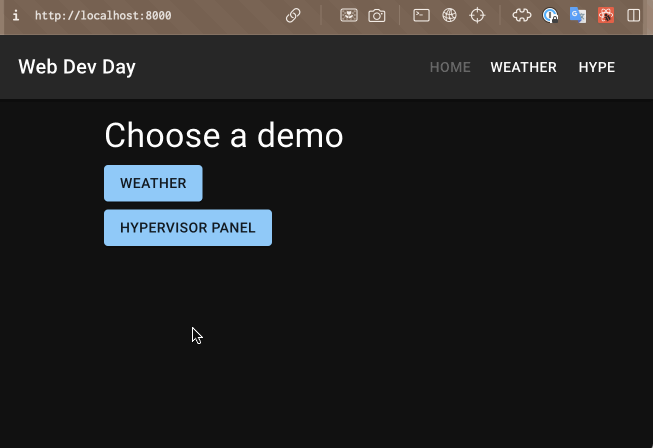
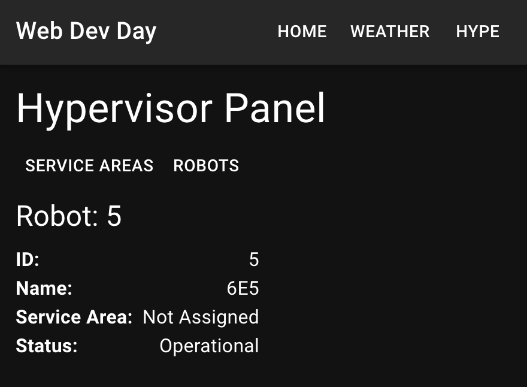
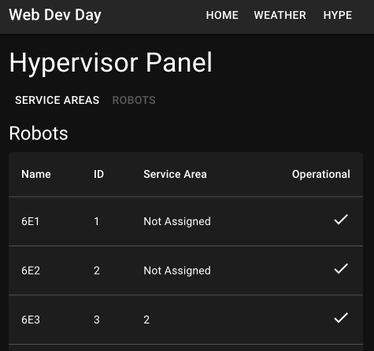

# GraphQL Mutations

We will look into how we can modify the data on the server by running GraphQL mutations. This is equivalent of making POST requests to ask the server to change data in the REST API terms.

First we will add a Robots page similar to the Service Areas page. Display the list of Robots and assign them to Service Areas.

We will also add a menu inside `Hype` route layout so that we can switch between Service Areas and Robots pages.

Let's start by adding the Robots route:

**src/App.tsx**

```diff
 import "@fontsource/roboto/500.css";
 import "@fontsource/roboto/700.css";
 import { QueryClient, QueryClientProvider } from "@tanstack/react-query";
-import { Route, Routes, BrowserRouter } from "react-router-dom";
-import HomePage from "./pages/HomePage";
-import WeatherPage from "./pages/WeatherPage";
-import NotFoundPage from "./pages/NotFoundPage";
+import { BrowserRouter, Navigate, Route, Routes } from "react-router-dom";
 import PageLayout from "./components/PageLayout";
+import HomePage from "./pages/HomePage";
 import HypePage from "./pages/HypePage";
-import ServiceAreasPage from "./pages/ServiceAreasPage";
+import NotFoundPage from "./pages/NotFoundPage";
 import ServiceAreaDetailPage from "./pages/ServiceAreaDetailPage";
+import ServiceAreasPage from "./pages/ServiceAreasPage";
+import WeatherPage from "./pages/WeatherPage";
+import RobotsPage from "./pages/RobotsPage";
 
 const queryClient = new QueryClient();
 
             ...
             <Route index element={<HomePage />} />
             <Route path="weather" element={<WeatherPage />} />
             <Route path="hype/" element={<HypePage />}>
-              <Route index element={<ServiceAreasPage />} />
+              <Route index element={<Navigate to="service-areas" />} />
+              <Route
+                index
+                path="service-areas"
+                element={<ServiceAreasPage />}
+              />
               <Route
                 path="service-area/:id"
                 element={<ServiceAreaDetailPage />}
               />
+              <Route path="robots" element={<RobotsPage />} />
             </Route>
             <Route path="*" element={<NotFoundPage />} />
           </Route>
```

We changed `ServiceAreasPage` to be a regular nested route under the `/hype` route. We then crated a new `service-areas` route and assigned `ServiceAreasPage` as it's element. This will be handled as `/hype/service-areas`.

After the changes there's no route to handle just `/hype`, it will end up in `*` route and `NotFoundPage` will be shown. To fix this we can create a nested `index` route under `/hype` and route it to `<Navigate to="service-areas">`. When a user goes to `/hype` path they will be redirected to `/hype/service-areas`.

Then, let's update the `HypePage` so that it has "Service Areas" and "Robots" buttons. Similarly to how we implemented Header Menu to work:

**src/pages/HypePage.tsx**

```diff
+import Box from "@mui/material/Box";
+import Button from "@mui/material/Button";
 import Typography from "@mui/material/Typography";
-import { Link, Outlet } from "react-router-dom";
+import { Link, Outlet, matchRoutes, useLocation } from "react-router-dom";
+
+const menuItems: { title: string; path: string }[] = [
+  { title: "Service Areas", path: "/hype/service-areas" },
+  { title: "Robots", path: "/hype/robots" },
+];
 
 export default function HypePage() {
+  const location = useLocation();
+  const matchingRoutes = matchRoutes(menuItems, location);
+  const matchingRoutePath = matchingRoutes?.[0]?.route?.path;
+
   return (
     <>
       <Typography
       ...
       >
         Hypervisor Panel
       </Typography>
+
+      <Box>
+        {menuItems.map((item) => (
+          <Button
+            component={Link}
+            to={item.path}
+            key={item.path}
+            disabled={item.path === matchingRoutePath}
+            sx={{ color: "inherit" }}
+          >
+            {item.title}
+          </Button>
+        ))}
+      </Box>
+
       <Outlet />
     </>
   );
```

Now we can create the `RobotList` component. Our implementation will be very similar to `ServiceAreaList`:

**src/components/RobotList.tsx**

```tsx
import {
  gql,
  useSuspenseQuery as useApolloSuspenseQuery,
} from "@apollo/client";

import { useNavigate } from "react-router-dom";
import { Bot } from "../generated/types/server";
import { CommonDataTable } from "./CommonDataTable";

import NotOperationalIcon from "@mui/icons-material/BuildCircleOutlined";
import OperationalIcon from "@mui/icons-material/CheckOutlined";

const TableColumnHeaders = ["Name", "ID", "Service Area", "Operational"];

export default function RobotList() {
  const {
    data: { bots },
  } = useApolloSuspenseQuery<{ bots: Bot[] }>(AllRobotsQuery);

  const navigate = useNavigate();

  return (
    <CommonDataTable
      onRowClicked={(bot) => navigate(`/hype/robot/${bot.id}`)}
      rows={bots}
      columnHeaders={TableColumnHeaders}
      cellsForRow={(bot) => ({
        key: bot.id,
        cells: [
          bot.name,
          bot.id,
          bot.serviceAreaId ?? "Not Assigned",
          bot.operational ? <OperationalIcon /> : <NotOperationalIcon />,
        ],
      })}
    />
  );
}

const AllRobotsQuery = gql`
  query AllRobotsAreasQuery {
    bots {
      id
      name
      serviceAreaId
      operational
    }
  }
`;
```

What we have done are mostly the same implementations as with `RobotList` with these differences;
- we fetch a different GraphQL query `bots {...}`
- we switch between `OperationalIcon` and `NotOperationalIcon` depending on `operational` value of the bot
- when a bot row is clicked, we send the user to `hype/bots/:id` (which is not implemented yet)
- if the `serviceArea` value of a bot is not defined we show "Not Assigned" instead

We will make a UI that we can assign robots to service areas later.

Final step to put all of this together is to implement the new `RobotList` component in a `RobotsPage` component. Similarly as how we implemented `ServiceAreaList` and `ServiceAreasPage`.

Let's crate the `RobotsPage`:

**src/pages/RobotsPage.tsx**

```tsx
import Alert from "@mui/material/Alert/Alert";
import Typography from "@mui/material/Typography";
import { Suspense } from "react";
import { ErrorBoundary } from "react-error-boundary";
import RobotList from "../components/RobotList";

export default function ServiceAreasPage() {
  return (
    <>
      <Typography variant="h5" component="h3">
        Robots
      </Typography>
      <ErrorBoundary
        fallbackRender={({ error }) => (
          <Alert severity="error">{error.message}</Alert>
        )}
      >
        <Suspense fallback={<div>loading...</div>}>
          <RobotList />
        </Suspense>
      </ErrorBoundary>
    </>
  );
}
```

Implementation is very similar to `ServiceAreasPage`, only the skeleton is missing from for the loading state.

Now, when you go to `localhost:8000/hype` you should be redirected to `/hype/service-areas`. Clicking "Robots" and "Service Areas" buttons should change the pages. Clicking the "Hypervisor Panel" should take you back to `/hype`.



You might have noticed that the robots we are listing don't have a Service Area assigned. We can make a page for assigning Robots to Service Areas.

We will create a `RobotDetailPage` where we can see the robot details, and modify which Service Area it is assigned to.

Let's add a new route `/robot/:id`:

**src/App.tsx**

```diff
 ...
 import HomePage from "./pages/HomePage";
 import HypePage from "./pages/HypePage";
 import NotFoundPage from "./pages/NotFoundPage";
+import RobotDetailPage from "./pages/RobotDetailPage";
 import ServiceAreaDetailPage from "./pages/ServiceAreaDetailPage";
 import ServiceAreasPage from "./pages/ServiceAreasPage";
 import WeatherPage from "./pages/WeatherPage";
 
 const queryClient = new QueryClient();
 
                 ...
                 element={<ServiceAreaDetailPage />}
               />
               <Route path="robots" element={<RobotsPage />} />
+              <Route path="robot/:id" element={<RobotDetailPage />} />
             </Route>
             <Route path="*" element={<NotFoundPage />} />
           </Route>

```

Create a `RobotDetails` page similar to `ServiceAreaDetails`.

**src/components/RobotDetails.tsx**

```tsx
import { gql, useSuspenseQuery } from "@apollo/client";
import Box from "@mui/material/Box";
import { Bot } from "../generated/types/server";
import TitleValueRow from "./TitleValueRow";

export default function RobotDetails({ id }: { id?: string }) {
  if (!id) {
    throw new Error("Unknown robot ID");
  }

  const {
    data: { bot: robot },
  } = useSuspenseQuery<{ bot: Bot }>(ServiceAreaDetailsQuery, {
    variables: { id },
  });

  return (
    <Box sx={{ display: "flex", flexDirection: "column", flex: 1 }}>
      <TitleValueRow title="ID" value={robot.id} />
      <TitleValueRow title="Name" value={robot.name} />
      <TitleValueRow
        title="Service Area"
        value={robot.serviceAreaId ?? "Not Assigned"}
      />
      <TitleValueRow
        title="Status"
        value={robot.operational ? "Operational" : "Not Operational"}
      />
    </Box>
  );
}

const ServiceAreaDetailsQuery = gql`
  query RobotDetailsQuery($id: ID!) {
    bot(id: $id) {
      id
      name
      serviceAreaId
      operational
    }
  }
`;
```

Then, to put all of these together create a `RobotDetailPage` page component:

**src/pages/RobotDetailPage.tsx**

```tsx
import Typography from "@mui/material/Typography";
import { useParams } from "react-router-dom";
import { Suspense } from "react";
import { ErrorBoundary } from "react-error-boundary";
import Alert from "@mui/material/Alert";
import RobotDetails from "../components/RobotDetails";

export default function RobotDetailPage() {
  const { id: robotId } = useParams();

  return (
    <>
      <Typography variant="h5" component="h3">
        Robot: {robotId}
      </Typography>
      <ErrorBoundary
        fallbackRender={({ error }) => (
          <Alert severity="error">{error.message}</Alert>
        )}
      >
        <Suspense fallback={<>loading...</>}>
          <RobotDetails id={robotId} />
        </Suspense>
      </ErrorBoundary>
    </>
  );
}
```

Now when you go to `localhost:8000/hype/robots` you should be able to click on the rows. Clicking a row should take you to the details of the selected robot.



We need an UI to be able to assign a robot to a Service Area so let's create a Dialog.

We can build a dialog using `Select` and `Dialog` components from MUI:

**src/components/AssignRobotDialog.tsx**

```tsx
import { gql, useMutation } from "@apollo/client";
import Box from "@mui/material/Box";
import Button from "@mui/material/Button";
import Dialog from "@mui/material/Dialog";
import DialogActions from "@mui/material/DialogActions";
import DialogContent from "@mui/material/DialogContent";
import DialogContentText from "@mui/material/DialogContentText";
import DialogTitle from "@mui/material/DialogTitle";
import MenuItem from "@mui/material/MenuItem";
import Select from "@mui/material/Select/Select";
import useTheme from "@mui/material/styles/useTheme";
import useMediaQuery from "@mui/material/useMediaQuery/useMediaQuery";
import { useState } from "react";

const DefaultSelectValue = "not-assigned";

export default function AssignRobotDialog({ botId }: { botId: string }) {
  const [open, setOpen] = useState(false);

  const [selectedServiceAreaId, setSelectedServiceAreaId] =
    useState<string>(DefaultSelectValue);

  const theme = useTheme();
  const fullScreen = useMediaQuery(theme.breakpoints.down("md"));

  const handleClickOpen = () => setOpen(true);
  const handleClose = () => setOpen(false);

  const [assignBotToServiceArea, { loading }] = useMutation(
    AssignBotToServiceAreaMutation,
    {
      variables: {
        botId,
        serviceAreaId: selectedServiceAreaId,
      },
    }
  );

  const handleAssignConfirmed = async () => {
    await assignBotToServiceArea();
    handleClose();
  };

  return (
    <>
      <Button variant="outlined" onClick={handleClickOpen}>
        Assign robot to service area
      </Button>
      <Dialog fullScreen={fullScreen} open={open} onClose={handleClose}>
        <DialogTitle>Assign Robot {botId} To Service Area</DialogTitle>
        <DialogContent sx={{ gap: 2 }}>
          <DialogContentText>
            Select a service area from below to assign the robot {botId} to.
          </DialogContentText>
          <Box>
            <Select
              disabled={loading}
              value={selectedServiceAreaId}
              onChange={(event) => setSelectedServiceAreaId(event.target.value)}
              autoWidth
            >
              <MenuItem value={DefaultSelectValue} disabled>
                <em>Select a service area</em>
              </MenuItem>
              <MenuItem value={"1"}>Helsinki</MenuItem>
              <MenuItem value={"2"}>London</MenuItem>
              <MenuItem value={"3"}>Melbourne</MenuItem>
              <MenuItem value={"4"}>Tallinn</MenuItem>
            </Select>
          </Box>
        </DialogContent>
        <DialogActions>
          <Button onClick={handleClose} disabled={loading}>
            Cancel
          </Button>
          <Button
            onClick={handleAssignConfirmed}
            disabled={loading || selectedServiceAreaId === DefaultSelectValue}
          >
            Assign
          </Button>
        </DialogActions>
      </Dialog>
    </>
  );
}

const AssignBotToServiceAreaMutation = gql`
  mutation AssignBotToServiceArea($botId: ID!, $serviceAreaId: ID!) {
    assignBotToServiceArea(botId: $botId, serviceAreaId: $serviceAreaId) {
      id
      serviceAreaId
    }
  }
`;
```

I hardcoded our Service Areas into the code, for the sake of simplicity. Ideally we could make another query to our API to get the Service Area options.

The essential part here is the `useMutation` hook from Apollo Client:

```tsx
const [assignBotToServiceArea, { loading }] = useMutation(
  AssignBotToServiceAreaMutation,
  {
    variables: {
      botId,
      serviceAreaId: selectedServiceAreaId,
    },
  }
);
```

When we call the `assignBotToServiceArea` it executes the mutation with `botId` and `serviceAreaId` parameters:

```tsx
const handleAssignConfirmed = async () => {
  await assignBotToServiceArea();
  handleClose();
};
```

Next we use this new `AssignRobotDialog` in `RobotDetails` component.

```diff
 ...
 import Box from "@mui/material/Box";
 import { Bot } from "../generated/types/server";
 import TitleValueRow from "./TitleValueRow";
+import AssignRobotDialog from "./AssignRobotDialog";
 
 export default function RobotDetails({ id }: { id?: string }) {
   if (!id) {
         ...
         title="Status"
         value={robot.operational ? "Operational" : "Not Operational"}
       />
+      <AssignRobotDialog botId={id} />
     </Box>
   );
 }
```

Try assigning a robot to a Service Area at `localhost:8000/hype/robots`.



Notice when we update the Service Area value of a robot in the dialog, the Service Area ID automatically changes in the robot detail page as well. This is because mutation response updates the Apollo client cache. And the `useQuery` or `useSuspenseQuery` hooks get notified about the change and trigger a redraw of the UI.

Therefore we don't need to manually re-fetch the UI just to get the updates.