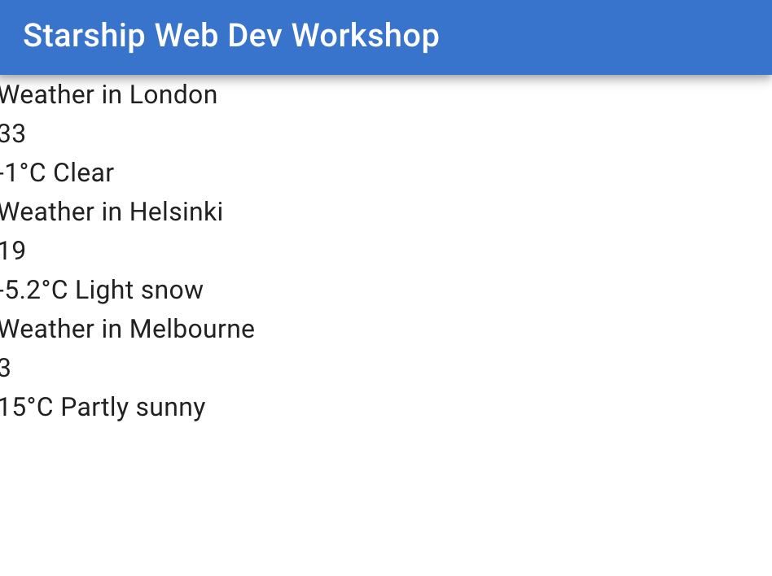

# Improving Design

Let's work on the design a bit. We will try to address these issues;
- We are missing many icons, we have been using substitute emojis
- Weather condition icon id's are shown as numbers

## MUI (Material UI library)

We will implement the [material ui](https://mui.com/material-ui/getting-started/installation/) library.
MUI gives us good looking basic pre designed components that we can build our ui's blocks they provide.
It has a layout system, many kinds of buttons and containers, tables and much more.

We use this extensively in Starship operations services tools like Hype Panel. And partially in Ground Control App as well. (Material ui is implemented in React Native through [Paper ui library](https://reactnativepaper.com/))

To begin, install the npm modules

```bash
npm install @mui/material @emotion/react @emotion/styled @fontsource/roboto @mui/icons-material
```

We install these modules

- `@mui/material` : the ui library
- `@emotion/styled`  : the styling library
- `@emotion/react`  : styling library bindings for react
- `@fontsource/roboto`  : font
- `@mui/icons-material` : icon package

Add the roboto font as dependency to our app so it gets bundled

**src/App.tsx**

```diff
  import { QueryClient, QueryClientProvider } from "@tanstack/react-query";
  import "./App.css";
  import CityWeatherContainer from "./components/CityWeatherContainer";
  
+ import "@fontsource/roboto/300.css";
+ import "@fontsource/roboto/400.css";
+ import "@fontsource/roboto/500.css";
+ import "@fontsource/roboto/700.css";
  
  const queryClient = new QueryClient();
  
  function App() {
    return (
  ...
```

remember to run `npm run dev` in docker shell again.

Let's test if MUI is installed correctly by adding a button temporarily to root page

**src/App.tsx**
```diff
  import "@fontsource/roboto/500.css";
  import "@fontsource/roboto/700.css";
  
+ import Button from "@mui/material/Button";
  
  const queryClient = new QueryClient();
  
  function App() {
    return (
      <QueryClientProvider client={queryClient}>
        <>
+         <Button variant="contained">MUI Button</Button>
          <h1>Starship Web Dev Workshop</h1>
          <div className="forecasts-container">
            <CityWeatherContainer city="London" />
```

You should see a button above the title. If you don't see, then something might have gone wrong.


Let's roll the changes above back. We won't need this button here.

You can refer to this [All MUI Components page](https://mui.com/material-ui/all-components/) for choosing components to use.

Let's start by deleting all the `.css` files! 
We won't need any of them because we will implement styles using MUI's theme system using a concept called **css-in-js** basically means writing styles in typescript alongside our react components.

delete these files;
- **src/App.css**
- **src/index.css**
- **src/WeatherForecast.css**

We will re-implement styles of weather components again using MUI components soon.

We need to remove all references to these css files otherwise our app won't build

in `WeatherForecast.tsx`
```diff
- import useWeatherConditions from "../hooks/useWeatherConditions";
```

in `App.tsx`
```diff
- import "./App.css";
```

in `main.tsx`
```diff
- import './index.css'
```

Also in `main.tsx` start implementing MUI

```diff
  import React from "react";
  import ReactDOM from "react-dom/client";
  import App from "./App.tsx";
+ import { StyledEngineProvider } from "@mui/material/styles";
  
  ReactDOM.createRoot(document.getElementById("root")!).render(
    <React.StrictMode>
+     <StyledEngineProvider injectFirst>
        <App />
+     </StyledEngineProvider>
    </React.StrictMode>
  );
```

In `App.tsx` we will import and implement `PageLayout` component which we haven't created yet. We'll soon do that but for now pretend that it exists.

Also we'll delete the page title. We will implement it in the `PageLayout` component.

Notice that this component takes in children elements.

```diff
  import "@fontsource/roboto/300.css";
  import "@fontsource/roboto/400.css";
  import "@fontsource/roboto/500.css";
  import "@fontsource/roboto/700.css";
  import { QueryClient, QueryClientProvider } from "@tanstack/react-query";
  import CityWeatherContainer from "./components/CityWeatherContainer";
+ import PageLayout from "./components/PageLayout";
  
  const queryClient = new QueryClient();
  
  function App() {
    return (
      <QueryClientProvider client={queryClient}>
-     <>
-       <h1>Starship Web Dev Workshop</h1>
+       <PageLayout>
          <div className="forecasts-container">
            <CityWeatherContainer city="London" />
            <CityWeatherContainer city="Helsinki" />
            <CityWeatherContainer city="Melbourne" />
          </div>
+       </PageLayout>
-     </>
      </QueryClientProvider>
    );
  }
  
  export default App;
```

Create a new `PageHeader` component file. We will move the page tile there.

**src/components/PageHeader.tsx**

```tsx
import AppBar from "@mui/material/AppBar";
import Toolbar from "@mui/material/Toolbar";
import Typography from "@mui/material/Typography";

export default function PageHeader() {
  return (
    <AppBar position="static">
      <Toolbar>
        <Typography variant="h6" component="div" sx={{ flexGrow: 1 }}>
          Starship Web Dev Workshop
        </Typography>
      </Toolbar>
    </AppBar>
  );
}
```

And finally let's create the `PageLayout.tsx` component that will put everything together.

**src/components/PageLayout.tsx**

```tsx
import { ThemeProvider } from "@emotion/react";
import { CssBaseline } from "@mui/material";
import { createTheme } from "@mui/material/styles";
import useMediaQuery from "@mui/material/useMediaQuery";
import { useMemo } from "react";
import PageHeader from "./PageHeader";

type PageLayoutProps = {
  children: React.ReactNode;
};

export default function PageLayout({ children }: PageLayoutProps) {
  const prefersDarkMode = useMediaQuery("(prefers-color-scheme: dark)");

  const theme = useMemo(
    () =>
      createTheme({
        palette: {
          mode: prefersDarkMode ? "dark" : "light",
        },
      }),
    [prefersDarkMode]
  );

  return (
    <ThemeProvider theme={theme}>
      <CssBaseline />
      <PageHeader />
      {children}
    </ThemeProvider>
  );
}
```

There are several things happening here;
- This component takes a `children` prop with type `React.ReactNode`. This means that we can take all the elements in between `<PageLayout> ... </PageLayout>` tags as a prop value. Then render it inside `PageLayout` component as `{children}` This allows us to swap page contents but keep the same layout.
- `useMediaQuery`. This is a hook from MUI which allows us to run media queries on browser. In this case we we are checking if the browser prefers dark theme.
- `const theme = useMemo(..., [prefersDarkMode])`. This hook from React allows us to calculate new values only when dependencies change. In this case we reevaluate the theme when `prefersDarkTheme` changes.
- We pass the theme to `ThemeProvider` so that entire app style changes based on browser colorscheme preference.

Now try going to `localhost:8000` and check if everything works as expected. You should see one of the styles below, depending on your system preference. Our weather components look horrible but don't worry about them yet. We will re-implement their styles.

Try changing your OS theme preference to see if browser live updates the colorscheme to the theme.

### Light mode



### Dark mode

