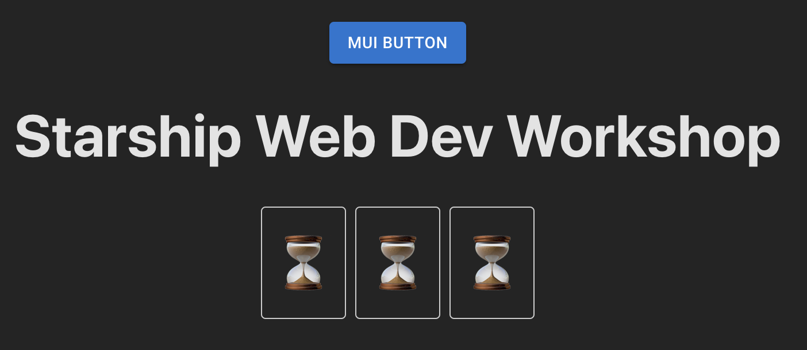
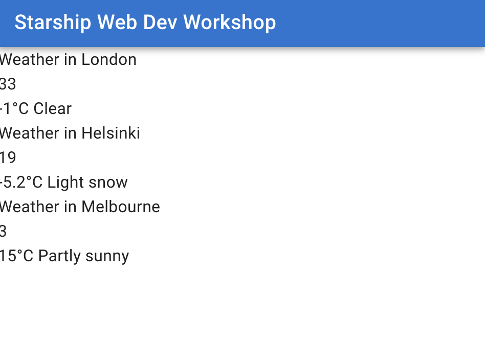
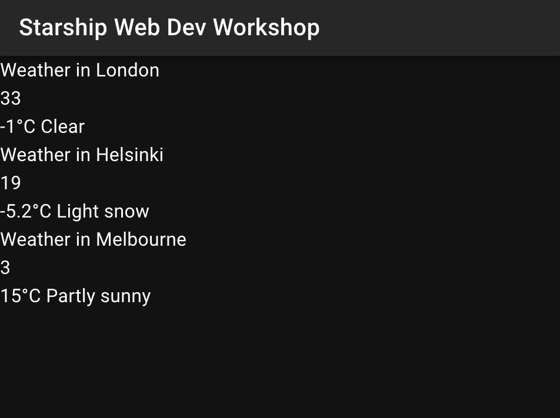
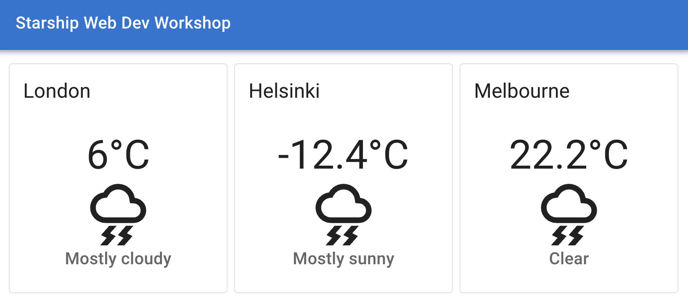
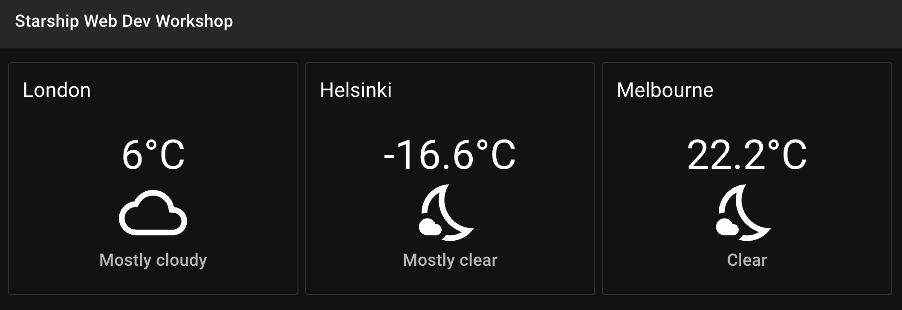

# Improving Design

Let's work on the design a bit. We will try to address these issues;

- We are missing many icons, instead we've been using substitute emojis
- Weather condition icon ID's are shown as numbers

## MUI (Material UI library)

We will implement the [material ui](https://mui.com/material-ui/getting-started/installation/) library.
MUI gives us good looking pre-designed components from which we can build our UI's blocks. MUI has a layout system, many kinds of buttons and containers, tables and much more.

You can refer to this [All MUI Components page](https://mui.com/material-ui/all-components/) for choosing components to use.

We use MUI extensively in Starship operations services tools like Hype Panel and partially in Ground Control App as well. (Material ui is implemented in React Native through [Paper ui library](https://reactnativepaper.com/))

To begin, install the npm modules:

```bash
npm install @mui/material @emotion/react @emotion/styled @fontsource/roboto @mui/icons-material
```

We'll install these modules;

- `@mui/material` : the ui library
- `@emotion/styled` : the styling library
- `@emotion/react` : styling library bindings for react
- `@fontsource/roboto` : font
- `@mui/icons-material` : icon package

Add the roboto font as a dependency to our app so it gets bundled:

**src/App.tsx**

```diff
  import { QueryClient, QueryClientProvider } from "@tanstack/react-query";
  import "./App.css";
  import CityWeatherContainer from "./components/CityWeatherContainer";

+ import "@fontsource/roboto/300.css";
+ import "@fontsource/roboto/400.css";
+ import "@fontsource/roboto/500.css";
+ import "@fontsource/roboto/700.css";

  const queryClient = new QueryClient();

  function App() {
    return (
  ...
```

Remember to run `npm run dev` in docker shell again to start the development server.

Let's test if MUI is installed correctly by adding a button temporarily to the `App` root page:

**src/App.tsx**

```diff
  import "@fontsource/roboto/500.css";
  import "@fontsource/roboto/700.css";

+ import Button from "@mui/material/Button";

  const queryClient = new QueryClient();

  function App() {
    return (
      <QueryClientProvider client={queryClient}>
        <>
+         <Button variant="contained">MUI Button</Button>
          <h1>Starship Web Dev Workshop</h1>
          <div className="forecasts-container">
            <CityWeatherContainer city="London" />
```

You should see a button above the title.



Let's delete the button and continue.

Start by deleting all the `.css` files! We won't need any of them because we will implement styles using MUI's theme system using a concept called **css-in-js**. css-in-js allows us to write styles in Typescript alongside our React components.

Delete these files;

- **src/App.css**
- **src/index.css**
- **src/components/WeatherForecast.css**

We will re-implement styles of the weather components using MUI components soon. First, we need to remove all the references to the deleted CSS files, otherwise our app won't build:

in `WeatherForecast.tsx`

```diff
- import useWeatherConditions from "../hooks/useWeatherConditions";
```

in `App.tsx`

```diff
- import "./App.css";
```

in `main.tsx`

```diff
- import './index.css'
```

In `main.tsx` start implementing MUI:

```diff
  import React from "react";
  import ReactDOM from "react-dom/client";
  import App from "./App.tsx";
+ import { StyledEngineProvider } from "@mui/material/styles";

  ReactDOM.createRoot(document.getElementById("root")!).render(
    <React.StrictMode>
+     <StyledEngineProvider injectFirst>
        <App />
+     </StyledEngineProvider>
    </React.StrictMode>
  );
```

In `App.tsx` we will import and implement `PageLayout` component which we haven't created yet. We'll soon do that but for now let's pretend that it exists.

We'll also delete the page title and implement it in the `PageLayout` component.

Notice that this component takes in child elements:

```diff
  import "@fontsource/roboto/300.css";
  import "@fontsource/roboto/400.css";
  import "@fontsource/roboto/500.css";
  import "@fontsource/roboto/700.css";
  import { QueryClient, QueryClientProvider } from "@tanstack/react-query";
  import CityWeatherContainer from "./components/CityWeatherContainer";
+ import PageLayout from "./components/PageLayout";

  const queryClient = new QueryClient();

  function App() {
    return (
      <QueryClientProvider client={queryClient}>
-     <>
-       <h1>Starship Web Dev Workshop</h1>
+       <PageLayout>
          <div className="forecasts-container">
            <CityWeatherContainer city="London" />
            <CityWeatherContainer city="Helsinki" />
            <CityWeatherContainer city="Melbourne" />
          </div>
+       </PageLayout>
-     </>
      </QueryClientProvider>
    );
  }

  export default App;
```

Create a new `PageHeader` component file. We will move the page tile there:

**src/components/PageHeader.tsx**

```tsx
import AppBar from "@mui/material/AppBar";
import Toolbar from "@mui/material/Toolbar";
import Typography from "@mui/material/Typography";

export default function PageHeader() {
  return (
    <AppBar position="static">
      <Toolbar>
        <Typography variant="h6" component="div" sx={{ flexGrow: 1 }}>
          Starship Web Dev Workshop
        </Typography>
      </Toolbar>
    </AppBar>
  );
}
```

Finally, let's create the `PageLayout.tsx` component that will put everything together:

**src/components/PageLayout.tsx**

```tsx
import { ThemeProvider } from "@emotion/react";
import { CssBaseline } from "@mui/material";
import { createTheme } from "@mui/material/styles";
import useMediaQuery from "@mui/material/useMediaQuery";
import { useMemo } from "react";
import PageHeader from "./PageHeader";

type PageLayoutProps = {
  children: React.ReactNode;
};

export default function PageLayout({ children }: PageLayoutProps) {
  const prefersDarkMode = useMediaQuery("(prefers-color-scheme: dark)");

  const theme = useMemo(
    () =>
      createTheme({
        palette: {
          mode: prefersDarkMode ? "dark" : "light",
        },
      }),
    [prefersDarkMode]
  );

  return (
    <ThemeProvider theme={theme}>
      <CssBaseline />
      <PageHeader />
      {children}
    </ThemeProvider>
  );
}
```

There are several things happening here;

- The component takes a `children` prop with type `React.ReactNode`. This means that we can take all the elements in between `<PageLayout> ... </PageLayout>` tags as a prop value. We then render it inside `PageLayout` component as `{children}` This allows us to swap page contents but keep the same layout.
- `useMediaQuery` is a hook from MUI which allows us to run media queries on browser. In this case we we are checking if the browser prefers a dark theme.
- `const theme = useMemo(..., [prefersDarkMode])` hook from React allows us to calculate new values only when dependencies change. In this case we re-evaluate the theme when `prefersDarkTheme` changes.
- We pass the theme to `ThemeProvider` so that the entire app's style changes based on the browser's colorscheme preference.

Now try going to `localhost:8000` and check if everything works as expected. You should see one of the styles below, depending on your system preference. Our weather components look horrible but don't worry about them yet. We will re-implement their styles.

Try changing your OS theme preference to see if the browser live updates the colorscheme to the OS theme.

### Light mode



### Dark mode



## Implementing MUI components & styles

Now that MUI is setup, we can start fixing the weather components we broke by deleting the `.css` files.

Let's start by updating `App.tsx` so that we have a `flexbox` container for our `CityWeatherContainer` components.

[CSS Flexbox](https://www.w3schools.com/csS/css3_flexbox.asp) is a CSS layout model that allows for efficient arrangement of items within a container, enabling responsive design and alignment control.

We will replace the `<div> </div>` container for the cities with a `Box` element from MUI.

```diff
  import "@fontsource/roboto/300.css";
  import "@fontsource/roboto/400.css";
  import "@fontsource/roboto/500.css";
  import "@fontsource/roboto/700.css";
  import { QueryClient, QueryClientProvider } from "@tanstack/react-query";
  import CityWeatherContainer from "./components/CityWeatherContainer";
  import PageLayout from "./components/PageLayout";
+ import Box from "@mui/material/Box";

  const queryClient = new QueryClient();

  function App() {
    return (
      <QueryClientProvider client={queryClient}>
        <PageLayout>
-         <div className="forecasts-container">
+         <Box sx={{ display: "flex", gap: 1, padding: 2 }}>
            <CityWeatherContainer city="London" />
            <CityWeatherContainer city="Helsinki" />
            <CityWeatherContainer city="Melbourne" />
-         </div>
+         </Box>
        </PageLayout>
      </QueryClientProvider>
    );
  }

  export default App;
```

Notice that we set `sx={{ display: "flex", gap: 1, padding: 2 }}` property which has inline CSS values. **S**tyle E**x**tension prop `sx` is used for adding styles to MUI elements without writing CSS.

Let's then improve the design of the `CityWeatherContainer`s:

**src/components/WeatherForecast.tsx**

```diff
  import WeatherForecast from "./WeatherForecast";
  import WeatherForecastLoading from "./WeatherForecastLoading";
  import { ErrorBoundary } from "react-error-boundary";
  import WeatherForecastError from "./WeatherForecastError";
+ import Card from "@mui/material/Card";
+ import Box from "@mui/material/Box";
+ import CardHeader from "@mui/material/CardHeader";
+ import CardContent from "@mui/material/CardContent";

  type CityWeatherContainerProps = {
    city: string;
  export default function CityWeatherContainer({
    city,
  }: CityWeatherContainerProps) {
    return (
-     <ErrorBoundary
-       fallbackRender={({ error }) => (
-         <WeatherForecastError message={error.message} />
-       )}
-     >
-       <Suspense fallback={<WeatherForecastLoading />}>
-         <WeatherForecast city={city} />
-       </Suspense>
-     </ErrorBoundary>
+     <Box sx={{ flex: 1 }}>
+       <Card variant="outlined">
+         <CardHeader title={city} />
+         <CardContent
+           sx={{
+             display: "flex",
+             flexDirection: "column",
+             alignItems: "center",
+           }}
+         >
+           <ErrorBoundary
+             fallbackRender={({ error }) => (
+               <WeatherForecastError message={error.message} />
+             )}
+           >
+             <Suspense fallback={<WeatherForecastLoading />}>
+               <WeatherForecast city={city} />
+             </Suspense>
+           </ErrorBoundary>
+         </CardContent>
+       </Card>
+     </Box>
    );
  }
```

Resulting `CityWeatherContainer` file should look like this:

**src/components/WeatherForecast.tsx**

```tsx
import { Suspense } from "react";
import WeatherForecast from "./WeatherForecast";
import WeatherForecastLoading from "./WeatherForecastLoading";
import { ErrorBoundary } from "react-error-boundary";
import WeatherForecastError from "./WeatherForecastError";
import Card from "@mui/material/Card";
import Box from "@mui/material/Box";
import CardHeader from "@mui/material/CardHeader";
import CardContent from "@mui/material/CardContent";

type CityWeatherContainerProps = {
  city: string;
};

export default function CityWeatherContainer({
  city,
}: CityWeatherContainerProps) {
  return (
    <Box sx={{ flex: 1 }}>
      <Card variant="outlined">
        <CardHeader title={city} />
        <CardContent
          sx={{
            display: "flex",
            flexDirection: "column",
            alignItems: "center",
          }}
        >
          <ErrorBoundary
            fallbackRender={({ error }) => (
              <WeatherForecastError message={error.message} />
            )}
          >
            <Suspense fallback={<WeatherForecastLoading />}>
              <WeatherForecast city={city} />
            </Suspense>
          </ErrorBoundary>
        </CardContent>
      </Card>
    </Box>
  );
}
```

We have wrapped everything in MUI `Box` with `flex: 1`. In a Flexbox layout, `flex: 1` sets an element to have a `flex-grow` value of 1, a `flex-shrink` value of 1, and a `flex-basis` value of 0%. This means the element can grow and shrink in relation to its siblings based on the available space in the container. Specifically, it will grow to absorb any extra space if the container is larger than the total width of its items, or shrink at the same rate as its siblings if the container is smaller, ensuring a dynamic, adaptable layout.

This will allow `CityWeatherContainer` and all of its sibling to take equal space and to be displayed next to each-other with the same proportions.

Next we'll used `Card` component from MUI. [See documentation of MUI Card component from here](https://mui.com/material-ui/react-card/). In addition, we'll implement `Card`'s sub components `CardHeader` and `CardContent`. `CardHeader` is now responsible for showing the city name and `CardContent` encapsulates `WeatherForecast` or `WeatherForecastError` or `WeatherForecastLoading` based on the behavior of `ErrorBoundary` and `Suspense`.

We also set `flexDirection: column` and `alignItems: center` styles from `sx` prop to the `CardContent` so that the children are layed out from top to bottom. Using `flexDirection: row` would lay them out from start to end (depending on the locale this is left to right, or right to left).

Finally let's update the style of `WeatherForecast.` We can pretty much re-write it using MUI components:

**src/components/WeatherForecast.tsx**

```tsx
import Typography from "@mui/material/Typography";
import ThunderstormOutlinedIcon from "@mui/icons-material/ThunderstormOutlined";
import useWeatherConditions from "../hooks/useWeatherConditions";

type WeatherForecastProps = {
  city: string;
};

export default function WeatherForecast(props: WeatherForecastProps) {
  const { weatherText, temperature } = useWeatherConditions(props.city);

  return (
    <>
      <Typography variant="h3" component="div">
        {temperature}°C
      </Typography>
      <ThunderstormOutlinedIcon sx={{ fontSize: "5em" }} />
      <Typography variant="h6" component="div" color="text.secondary">
        {weatherText}
      </Typography>
    </>
  );
}
```

Note the `color="text.secondary"` prop on the `Typography` element. This is our secondary title which displays the weather condition as text. `text.secondary` is a dynamic value from our default MUI theme. MUI fills this in with the appropriate color based on the dark / light color schemes.

Go to `localhost:8000` check how our app looks.



Looks nicer but the thunderstorm icon is hardcoded so we will need to fix that.

Accuweather sends us icon ID's for every weather condition. An index of the items [can be found here](https://developer.accuweather.com/weather-icons). We need to match the Accuweather icons to the iconset we get from MUI.

I have written the mappings so you don't have to. To save time let's copy paste this into a new file at `src/utils/weather.ts`:

**src/utils/weather.ts**

```ts
import Brightness7Outlined from "@mui/icons-material/Brightness7Outlined";
import CloudQueueOutlined from "@mui/icons-material/CloudQueueOutlined";
import FilterDramaOutlined from "@mui/icons-material/FilterDramaOutlined";
import CloudOutlined from "@mui/icons-material/CloudOutlined";
import LensBlurOutlined from "@mui/icons-material/LensBlurOutlined";
import GrainOutlined from "@mui/icons-material/GrainOutlined";
import FlashOnOutlined from "@mui/icons-material/FlashOnOutlined";
import AcUnitOutlined from "@mui/icons-material/AcUnitOutlined";
import InvertColorsOutlined from "@mui/icons-material/InvertColorsOutlined";
import NightsStayOutlined from "@mui/icons-material/NightsStayOutlined";
import WindPowerOutlined from "@mui/icons-material/WindPowerOutlined";
import WbSunnyOutlined from "@mui/icons-material/WbSunnyOutlined";
import type { SvgIconComponent } from "@mui/icons-material";

// Based on https://developer.accuweather.com/weather-icons
export const accuWeatherIconMap: { [key: number]: SvgIconComponent } = {
  1: WbSunnyOutlined, // Sunny
  2: Brightness7Outlined, // Mostly Sunny
  3: CloudOutlined, // Partly Sunny
  4: CloudQueueOutlined, // Intermittent Clouds
  5: FilterDramaOutlined, // Hazy Sunshine
  6: CloudOutlined, // Mostly Cloudy
  7: CloudOutlined, // Cloudy
  8: CloudOutlined, // Dreary (Overcast)
  11: LensBlurOutlined, // Fog
  12: GrainOutlined, // Showers
  13: GrainOutlined, // Mostly Cloudy w/ Showers
  14: GrainOutlined, // Partly Sunny w/ Showers
  15: FlashOnOutlined, // T-Storms
  16: FlashOnOutlined, // Mostly Cloudy w/ T-Storms
  17: FlashOnOutlined, // Partly Sunny w/ T-Storms
  18: GrainOutlined, // Rain
  19: AcUnitOutlined, // Flurries
  20: AcUnitOutlined, // Mostly Cloudy w/ Flurries
  21: AcUnitOutlined, // Partly Sunny w/ Flurries
  22: AcUnitOutlined, // Snow
  23: AcUnitOutlined, // Mostly Cloudy w/ Snow
  24: AcUnitOutlined, // Ice
  25: AcUnitOutlined, // Sleet
  26: InvertColorsOutlined, // Freezing Rain
  29: AcUnitOutlined, // Rain and Snow
  30: WbSunnyOutlined, // Hot
  31: AcUnitOutlined, // Cold
  32: WindPowerOutlined, // Windy
  33: NightsStayOutlined, // Clear (Night)
  34: NightsStayOutlined, // Mostly Clear (Night)
  35: NightsStayOutlined, // Partly Cloudy (Night)
  36: NightsStayOutlined, // Intermittent Clouds (Night)
  37: NightsStayOutlined, // Hazy Moonlight
  38: NightsStayOutlined, // Mostly Cloudy (Night)
  39: GrainOutlined, // Partly Cloudy w/ Showers (Night)
  40: GrainOutlined, // Mostly Cloudy w/ Showers (Night)
  41: FlashOnOutlined, // Partly Cloudy w/ T-Storms (Night)
  42: FlashOnOutlined, // Mostly Cloudy w/ T-Storms (Night)
  43: AcUnitOutlined, // Mostly Cloudy w/ Flurries (Night)
  44: AcUnitOutlined, // Mostly Cloudy w/ Snow (Night)
};
```

Now, we need to figure out how to dynamically pick the right icon based on accuweather icon id response.

One way to do it is by using the `useCallback` hook from React. As components are essentially functions, we will make a function that will return a layout. This layout will be different based on an icon's ID and remains unchanged if the icon ID doesn't change.

Then we will use this function as a component:

```tsx
const WeatherIcon = useCallback(() => {
  const IconComponent = accuWeatherIconMap[weatherIcon] ?? ErrorOutlined;
  return <IconComponent sx={{ fontSize: "5em" }} />;
}, [weatherIcon]);
```

This function will evaluates which icon component to use by looking up the `weatherIcon` id from the `accuWeatherIconMap` util we just created. If it can not find an icon it falls back to an `ErrorOutlined` icon and renders the component.

Let's see this implemented in the `WeatherForecast.tsx`:

```diff
  import Typography from "@mui/material/Typography";
- import ThunderstormOutlinedIcon from "@mui/icons-material/ThunderstormOutlined";
  import useWeatherConditions from "../hooks/useWeatherConditions";
+ import { useCallback } from "react";
+ import { accuWeatherIconMap } from "../utils/weather";
+ import { ErrorOutlined } from "@mui/icons-material";

  type WeatherForecastProps = {
    city: string;
  };

  export default function WeatherForecast(props: WeatherForecastProps) {
-   const { weatherText, temperature } = useWeatherConditions(props.city);
+   const { weatherText, temperature, weatherIcon } = useWeatherConditions(
+     props.city
+   );
+
+   const WeatherIcon = useCallback(() => {
+     const IconComponent = accuWeatherIconMap[weatherIcon] ?? ErrorOutlined;
+     return <IconComponent sx={{ fontSize: "5em" }} />;
+   }, [weatherIcon]);

    return (
      <>
        <Typography variant="h3" component="div">
          {temperature}°C
        </Typography>
-       <ThunderstormOutlinedIcon sx={{ fontSize: "5em" }} />
+       <WeatherIcon />
        <Typography variant="h6" component="div" color="text.secondary">
          {weatherText}
        </Typography>
      </>
    );
  }
```

Now that we replaced the hardcoded `ThunderstormOutlinedIcon` we should see the correct weather icons in our app. Go to `localhost:8000` to check the changes. You should see something like this.


