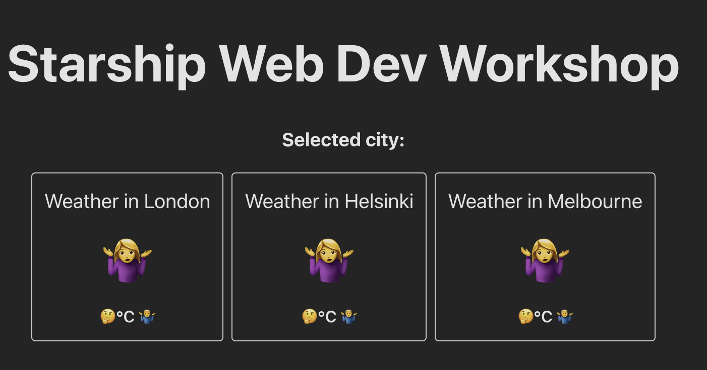
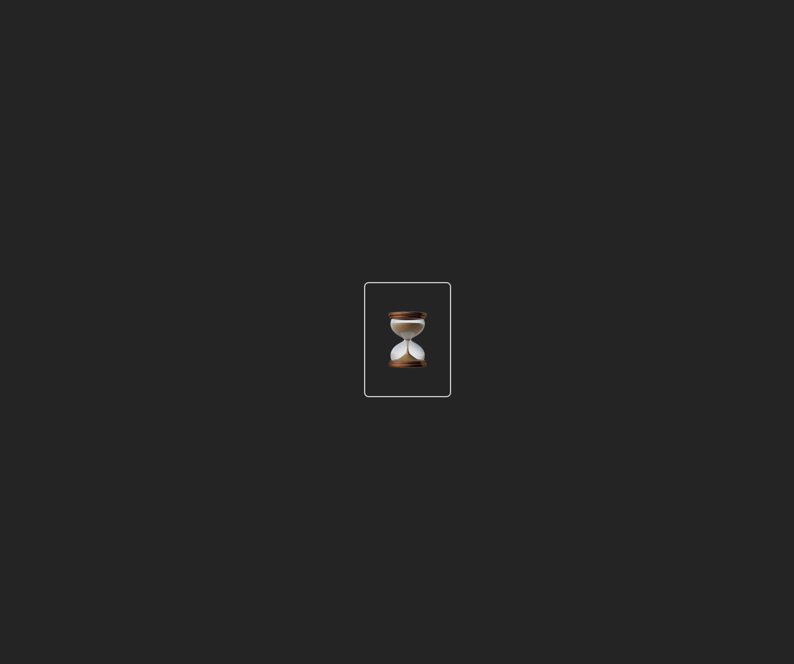
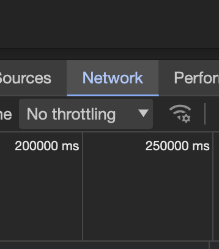
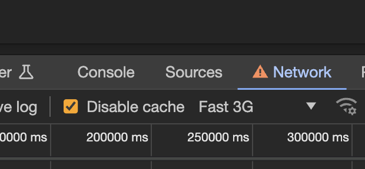

# Loading state & UX improvements

## Composing & reusing data

Before we have clicked on a city our UI is looking a little odd with no weather data. We need to handle a state without data.

First we'll make WeatherForecast accept null values. Again, later we will improve our solution, but for now instead of rendering nothing when values are `null` we can render some fallback strings

for icon "️🤷‍♀️"
for temperature "🤔"
for description "🤷‍♂️"

```diff
  type WeatherForecastProps = {
    city: string;
-   temperature: number;
+   temperature: number | null;
-   description: string;
+   description: string | null;
-   icon: string;
+   icon: string | null;
    onClick: (city: string) => void;
  };

  export default function WeatherForecast(props: WeatherForecastProps) {
    const handleOnClick = () => {
      props.onClick(props.city);
    };
    return (
      <div className="weather-forecast" onClick={handleOnClick}>
        <div className="weather-forecast-title">Weather in {props.city}</div>
-       <div className="weather-forecast-icon">{props.icon}</div>
+       <div className="weather-forecast-icon">{props.icon ?? "️🤷‍♀️"}</div>
        <div className="weather-forecast-value">
-         {props.temperature ?? "🤔"}°C {props.description}
+         {props.temperature ?? "🤔"}°C {props.description ?? "🤷‍♂️"}
        </div>
      </div>
    );
  }
```



Now WeatherForecast accepts null values and the red squiggle errors in App.tsx are gone, but we are still showing default values instead of a loading state.

Let's make a new component with these elements;

- loading of the data
- displaying loading state
- displaying errors
- displaying weather conditions

Create a new file in the path `src/components/CityWeatherContainer.tsx` and place the following inside the new file:

**src/components/CityWeatherContainer.tsx**

```tsx
import useWeatherConditions from "../hooks/useWeatherConditions";
import WeatherForecast from "./WeatherForecast";

type CityWeatherContainerProps = {
  city: string;
};

export default function CityWeatherContainer({
  city,
}: CityWeatherContainerProps) {
  const { reload, weatherIcon, weatherText, temperature } =
    useWeatherConditions(city);

  return (
    <WeatherForecast
      city={city}
      temperature={temperature}
      description={weatherText}
      icon={weatherIcon}
      onClick={reload}
    />
  );
}
```

Now we can delete a lot of code and reuse the new `CityWeatherContainer` we created instead! The new component composes all the functionality we are deleting from `App.tsx` per each city.

Let's implement our new component `CityWeatherContainer` for each city and delete all the code we won't be using anymore.

**src/App.tsx**

```diff
  import "./App.css";
- import { useState } from "react";
- import WeatherForecast from "./components/WeatherForecast";
- import useWeatherConditions from "./hooks/useWeatherConditions";
  import CityWeatherContainer from "./components/CityWeatherContainer";

  function App() {
-   const [selectedCity, updateSelectedCity] = useState<string | null>(null);
-   const helsinkiWeather = useWeatherConditions("helsinki");
-   const londonWeather = useWeatherConditions("london");
-   const melbourneWeather = useWeatherConditions("melbourne");
-
-   const handleOnForecastCityClicked = (city: string) => {
-     if (city.toLowerCase() === "helsinki") {
-       helsinkiWeather.reload();
-     }
-     if (city.toLowerCase() === "london") {
-       londonWeather.reload();
-     }
-     if (city.toLowerCase() === "melbourne") {
-       melbourneWeather.reload();
-     }
-     updateSelectedCity(city);
-   };

    return (
      <>
        <h1>Starship Web Dev Workshop</h1>
-       <h3>Selected city: {selectedCity}</h3>
        <div className="forecasts-container">
-         <WeatherForecast
-           city="London"
-           temperature={londonWeather.temperature}
-           description={londonWeather.weatherText}
-           icon={londonWeather.weatherIcon}
-           onClick={handleOnForecastCityClicked}
-         />
+         <CityWeatherContainer city="London" />
-         <WeatherForecast
-           city="Helsinki"
-           temperature={helsinkiWeather.temperature}
-           description={helsinkiWeather.weatherText}
-           icon={helsinkiWeather.weatherIcon}
-           onClick={handleOnForecastCityClicked}
-         />
+         <CityWeatherContainer city="Helsinki" />
-         <WeatherForecast
-           city="Melbourne"
-           temperature={melbourneWeather.temperature}
-           description={melbourneWeather.weatherText}
-           icon={melbourneWeather.weatherIcon}
-           onClick={handleOnForecastCityClicked}
-         />
+         <CityWeatherContainer city="Melbourne" />
        </div>
      </>
    );
  }

  export default App;
```

Resulting in much neater & shorter code:

**src/App.tsx**

```tsx
import "./App.css";
import CityWeatherContainer from "./components/CityWeatherContainer";

function App() {
  return (
    <>
      <h1>Starship Web Dev Workshop</h1>
      <div className="forecasts-container">
        <CityWeatherContainer city="London" />
        <CityWeatherContainer city="Helsinki" />
        <CityWeatherContainer city="Melbourne" />
      </div>
    </>
  );
}

export default App;
```

## Loading state

Next we'll make a component for the loading state. Again, create a new file for a new component.

**src/components/WeatherForecastLoading.tsx**

```tsx
export default function WeatherForecastLoading() {
  return (
    <div className="weather-forecast">
      <div className="weather-forecast-icon">⏳</div>
    </div>
  );
}
```

Inside the `useWeatherConditions` in
**src/hooks/useWeatherConditions.tsx** create a loading state by using the `useState` hook. It will keep track of the loading state and updates it accordingly when loading starts and ends.

```diff
 export default function useWeatherConditions(city: string) {
   const [weatherText, setWeatherText] = useState<string | null>(null);
   const [weatherIcon, setWeatherIcon] = useState<string | null>(null);
   const [temperature, setTemperature] = useState<number | null>(null);
+  const [loading, setLoading] = useState(false);

   const reload = async () => {
+    setLoading(true);
     const citySearchResponse = await fetch(

     ...

     setWeatherText(weatherText);
     setWeatherIcon(weatherIcon);
     setTemperature(temperature);

+    setLoading(false);
   };

   return {
     weatherText,
     weatherIcon,
     temperature,
     reload,
+    loading,
   };
 }
```

Implement the new `loading` property from `useWeatherConditions` in `CityWeatherContainerProps`:

**src/components/CityWeatherContainer.tsx**

```diff
  import useWeatherConditions from "../hooks/useWeatherConditions";
  import WeatherForecast from "./WeatherForecast";
+ import WeatherForecastLoading from "./WeatherForecastLoading";

  type CityWeatherContainerProps = {
    city: string;
  };

  export default function CityWeatherContainer({
    city,
  }: CityWeatherContainerProps) {
-   const { reload, weatherIcon, weatherText, temperature } =
+   const { reload, weatherIcon, weatherText, temperature, loading } =
      useWeatherConditions(city);

+   if (loading) {
+     return <WeatherForecastLoading />;
+   }

    return (
      <WeatherForecast
        city={city}
        temperature={temperature}
        description={weatherText}
        icon={weatherIcon}
        onClick={reload}
      />
    );
  }
```

When you go to `localhost:8000` and click on cities, you will see them turn into an ⏳ for a split second.



With our fast connections it's difficult to see it happen so for demonstration purposes we can add some network throttling.
In Chrome, or another browser, go to javascript developer console. Switch to the network tab. Click "no throttling" and change it to "Fast 3G".




While we are here, let's also enable "Disable cache" so that every time we click, data gets re-fetched. However, this is a fast way to eat up all of our accuweather api limits so be mindful of how many calls you send. If you hit the 50 API calls limit, delete & recreate accuweather app from the console to get a new API key.

**Turn caching back on** when your experiment with the loading state is done.



## Loading all cities at the beginning

Wouldn't it be nicer to see weather data right as we enter our app? Let's load all the forecasts automatically when the page appears so that we don't have to click to initiate loading.

We can use `useEffect` and `useState` hooks from React in `useWeatherConditions` to achieve this.

Before implementing `useEffect`, we first need to wrap the `reload` function with a `useCallback` hook so that we tell React to never recreate this function unless something really important changes.

A basic `useCallback` implementation looks like this:

```tsx
const myCallback = useCallback(() => {
  // your callback handler code here
}, [dependency, anotherDependency]);
```

This `myCallback` will only be created when the `dependency` and `otherDependency` have new values.

In our case, the `reload` callback only needs the dependency `city`. `reload` will need to do something different only when `city` has a different value. Otherwise it should remain the same.
For this we use the `useEffect` hook. Similar to `useCallback`, a `useEffect` hook also takes a function and a dependencies list. It will execute the function only when its dependencies change.

`useEffect` implementation looks like this:

```tsx
useEffect(() => {
  reload();
}, [city, reload]);
```

`city` value only changes once.
`reload` value from `useCallback` only changes once.

(Note: If we wouldn't wrap the reload function from earlier, it would get recreated every time the component code runs. Using reload in useEffect would cause an infinite loop, because useEffect has it as a dependency and runs its own callback whenever the dependencies change.)

These changes should happen at the same time when the app appears so we expect `reload()` to be called once.

**src/hooks/useWeatherConditions**

```diff
- import { useState } from "react";
+ import { useCallback, useEffect, useState } from "react";

  export default function useWeatherConditions(city: string) {

-   const reload = async () => {
+   const reload = useCallback(async () => {
      setLoading(true);

      ...

      setLoading(false);
-   }
+   }, [city]);

+   useEffect(() => {
+     reload();
+   }, [city, reload]);

    return {
      weatherText,
      weatherIcon,
      temperature,
      reload,
      loading,
    };
  }
```

You can go to `localhost:8000` and reload. You should see the city forecasts loading by themselves.


## About react's strict mode.

When you refresh the page and look at the network tab of the browser's developer console, you'll find that API calls aren't happening as we expected. More than 6 api calls are made, 12 to be exact. Why is that?

[Dupe api calls](assets/dupe-api-calls.png)

We are only expecting 6 API calls because we first search for the 3 cities to get their city keys and we then fetch the 3 weather conditions with the keys.

But we see 12 api calls. The cause of this is [React's strict mode](https://react.dev/reference/react/StrictMode).

If you check `main.tsx` file, you'll see. `<App />` is wrapped with `<React.StrictMode>`.
Removing the wrappers would disable the strict mode.

You can try to remove them and refreshing the page.

```diff
  ReactDOM.createRoot(document.getElementById("root")!).render(
-   <React.StrictMode>
      <App />
-   </React.StrictMode>
  );
```

You should now see that we get 6 requests as we expected before.

Strict mode is only applied for development mode, so let's put back the removed `<React.StrictMode>` tags. Our production app would make 6 requests instead of 12.

Strict mode is React's own development tool that executes code to analyze what changes it makes and generates warnings when required. React executes our `useEffect` functions once for analysis and then it is triggered because the dependencies are set. In the network logs it looks like as if we're doubling the amount of `reload()` function calls.

In normal cases you can safely ignore this. Especially when updating some UI only values etc. Since we are triggering API calls with a limit to Accuweather, we'll now implement this properly without wasting API calls.

Using `useEffect` to make API calls might seem like it works fine, but it is in fact an anti-pattern.

Next step we'll learn how to fix this properly using `react-query`.
