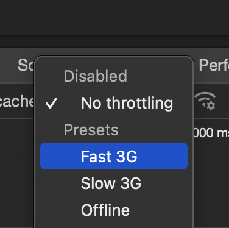

# Loading state & UX improvements

## Composing & reusing data

need to handle the state when we don't have data

let's first make weatherforecast accept null values

We will do something better later but for now instead rendering nothing when values are `null` we can render some fallback strings

for icon "️🤷‍♀️"
for temperature "🤔"
for description "🤷‍♂️"

```diff
  type WeatherForecastProps = {
    city: string;
-   temperature: number;
+   temperature: number | null;
-   description: string;
+   description: string | null;
-   icon: string;
+   icon: string | null;
    onClick: (city: string) => void;
  };
  
  export default function WeatherForecast(props: WeatherForecastProps) {
    const handleOnClick = () => {
      props.onClick(props.city);
    };
    return (
      <div className="weather-forecast" onClick={handleOnClick}>
        <div className="weather-forecast-title">Weather in {props.city}</div>
-       <div className="weather-forecast-icon">{props.icon}</div>
+       <div className="weather-forecast-icon">{props.icon ?? "️🤷‍♀️"}</div>
        <div className="weather-forecast-value">
-         {props.temperature ?? "🤔"}°C {props.description}
+         {props.temperature ?? "🤔"}°C {props.description ?? "🤷‍♂️"}
        </div>
      </div>
    );
  }
```

 

now weatherforecast accepets null values
check App.tsx squigglies gone

but we still show default values when loading
we should show a loading state instead

let's make a new component that composes these elements;
- loading of the data
- displaying loading state
- displaying errors
- displaying weather conditions

src/components/CityWeatherContainer.tsx

```tsx
import useWeatherConditions from "../hooks/useWeatherConditions";
import WeatherForecast from "./WeatherForecast";

type CityWeatherContainerProps = {
  city: string;
};

export default function CityWeatherContainer({
  city,
}: CityWeatherContainerProps) {
  const { reload, weatherIcon, weatherText, temperature } =
    useWeatherConditions(city);

  return (
    <WeatherForecast
      city={city}
      temperature={temperature}
      description={weatherText}
      icon={weatherIcon}
      onClick={reload}
    />
  );
}
```

now we can delete a lot of code. and reuse the new `CityWeatherContainer` we created instead. It composes all the functionality we are deleteting from `App.tsx` already per each city.

Let's implement our new component `CityWeatherContainer` for each city and delete all the code we won't use anymore.

src/App.tsx

```diff
  import "./App.css";
- import { useState } from "react";
- import WeatherForecast from "./components/WeatherForecast";
- import useWeatherConditions from "./hooks/useWeatherConditions";
  import CityWeatherContainer from "./components/CityWeatherContainer";
  
  function App() {
-   const [selectedCity, updateSelectedCity] = useState<string | null>(null);
-   const helsinkiWeather = useWeatherConditions("helsinki");
-   const londonWeather = useWeatherConditions("london");
-   const melbourneWeather = useWeatherConditions("melbourne");
- 
-   const handleOnForecastCityClicked = (city: string) => {
-     if (city.toLowerCase() === "helsinki") {
-       helsinkiWeather.reload();
-     }
-     if (city.toLowerCase() === "london") {
-       londonWeather.reload();
-     }
-     if (city.toLowerCase() === "melbourne") {
-       melbourneWeather.reload();
-     }
-     updateSelectedCity(city);
-   };
  
    return (
      <>
        <h1>Starship Web Dev Workshop</h1>
-       <h3>Selected city: {selectedCity}</h3>
        <div className="forecasts-container">
-         <WeatherForecast
-           city="London"
-           temperature={londonWeather.temperature}
-           description={londonWeather.weatherText}
-           icon={londonWeather.weatherIcon}
-           onClick={handleOnForecastCityClicked}
-         />
+         <CityWeatherContainer city="London" />
-         <WeatherForecast
-           city="Helsinki"
-           temperature={helsinkiWeather.temperature}
-           description={helsinkiWeather.weatherText}
-           icon={helsinkiWeather.weatherIcon}
-           onClick={handleOnForecastCityClicked}
-         />
+         <CityWeatherContainer city="Helsinki" />
-         <WeatherForecast
-           city="Melbourne"
-           temperature={melbourneWeather.temperature}
-           description={melbourneWeather.weatherText}
-           icon={melbourneWeather.weatherIcon}
-           onClick={handleOnForecastCityClicked}
-         />
+         <CityWeatherContainer city="Melbourne" />
        </div>
      </>
    );
  }
  
  export default App;
```

resulting code would be this, much neater & shorter.

**src/App.tsx**

```tsx
import "./App.css";
import CityWeatherContainer from "./components/CityWeatherContainer";

function App() {
  return (
    <>
      <h1>Starship Web Dev Workshop</h1>
      <div className="forecasts-container">
        <CityWeatherContainer city="London" />
        <CityWeatherContainer city="Helsinki" />
        <CityWeatherContainer city="Melbourne" />
      </div>
    </>
  );
}

export default App;
```

## Loading state


Let's make a component for the loading state

**src/components/WeatherForecastLoading.tsx**

```tsx
export default function WeatherForecastLoading() {
  return (
    <div className="weather-forecast">
      <div className="weather-forecast-icon">⏳</div>
    </div>
  );
}
```

in `useWeatherConditions`

**src/hooks/useWeatherConditions.tsx**

using the `useState` hook for keeping track of the loading state and updating it accordingly when loading starts and ends

```diff
 export default function useWeatherConditions(city: string) {
   const [weatherText, setWeatherText] = useState<string | null>(null);
   const [weatherIcon, setWeatherIcon] = useState<string | null>(null);
   const [temperature, setTemperature] = useState<number | null>(null);
+  const [loading, setLoading] = useState(false);
 
   const reload = async () => {
+    setLoading(true);
     const citySearchResponse = await fetch(
 
     ...
 
     setWeatherText(weatherText);
     setWeatherIcon(weatherIcon);
     setTemperature(temperature);
 
+    setLoading(false);
   };
 
   return {
     weatherText,
     weatherIcon,
     temperature,
     reload,
+    loading,
   };
 }
```

Implement this new `loading` property that `useWeatherConditions` in `CityWeatherContainerProps` 

**src/components/CityWeatherContainer.tsx**

```diff
  import useWeatherConditions from "../hooks/useWeatherConditions";
  import WeatherForecast from "./WeatherForecast";
+ import WeatherForecastLoading from "./WeatherForecastLoading";
 
  type CityWeatherContainerProps = {
    city: string;
  };
 
  export default function CityWeatherContainer({
    city,
  }: CityWeatherContainerProps) {
-   const { reload, weatherIcon, weatherText, temperature } =
+   const { reload, weatherIcon, weatherText, temperature, loading } =
      useWeatherConditions(city);
 
+   if (loading) {
+     return <WeatherForecastLoading />;
+   }
 
    return (
      <WeatherForecast
        city={city}
        temperature={temperature}
        description={weatherText}
        icon={weatherIcon}
        onClick={reload}
      />
    );
  }
```

When you go to `localhost:8000` and click on cities you will see them turn into ⏳ for a split second.


With our fast connections it's difficult to see it happen so we can add some network throttling.
In chrome and similar browsers. go to javascript developer console. Switch to network tab. Click "no throttling", change it to "Fast 3G".




While you are there also enable "Disable cache" so that every time we click, data gets re-fetched. However this is a fast way to eat up all of our accuweather api limits so beware. If you hit 50 API calls limit. Delete & recreate accuweather app from the console to get a new API key.

**Turn caching back on** when you experiment with the loading state so that we don't eat too much from our api call limit


## Loading all cities at the beginning

Let's load all the forecasts automatically when page appears so that we don't have to click to initiate loading.

We can use `useEffect` and `useState` hooks from React in `useWeatherConditions` to achieve this.

Before implementing `useEffect` first we need to wrap `reload` function with `useCallback` hook. So that we tell react to never recreate this function unless something really important changes.

A basic `useCallback` implementation looks like this

```tsx
const myCallback = useCallback(() => {
  // your callback handler code here
}, [dependency, anotherDependency])
```

This `myCallback` will only created when the `dependency` and `otherDependency` have new values.

In our case `reload` callback only needs the dependency `city`. `reload` will need to do something different only when `city` has a different value. Otherwise it should remain the same.

Then we can add `useEffect` hook. Similar to `useCallback`, `useEffect` hook also takes a function and a dependencies list. It will execute the function that has only when its dependencies change.

`useEffect` implementation looks like this. 

```tsx
useEffect(() => {
  reload();
}, [city, reload]);
```

`city` value only changes once.
`reload` value from `useCallback` only changes once.

(if we didn't wrap reload function from earlier then it would get recreated every time this component code runs. When we'd use reload in useEffect it would cause an infinite loop. Because useEffect has it as a dependency. And runs its own callback whenever dependencies change.)

These changes should happen at the same time when the app appears so we expect `reload()` to be called once.

**src/hooks/useWeatherConditions**
```diff
- import { useState } from "react";
+ import { useCallback, useEffect, useState } from "react";

  export default function useWeatherConditions(city: string) {

-   const reload = async () => {
+   const reload = useCallback(async () => {
      setLoading(true);

      ...

      setLoading(false);
-   }
+   }, [city]);

+   useEffect(() => {
+     reload();
+   }, [city, reload]);

    return {
      weatherText,
      weatherIcon,
      temperature,
      reload,
      loading,
    };
  }
```

You can go to `localhost:8000` and reload. You should see the city forecasts loading by themselves.


## About react's strict mode.

API calls won't happen as we expected though. When you refresh the page then if you look at browser's network tab of developer console.
You'll see more than 6 api calls made. 12 to be exact. Let's see why is that.

[dupe api calls](assets/dupe-api-calls.png)

We were expecting only 6 because. We search 3 cities to get their city keys. Then we fetch the current weather conditions with the keys we acquired per each 3 city. So that should add up to 6.

But we see 12 api calls. The cause of this is [React's strict mode](https://react.dev/reference/react/StrictMode).

If you check `main.tsx` file, you'll see. `<App />` is wrapped with `<React.StrictMode>`.
Removing them would disable the strict mode.

You can try to remove them then refresh the page.

```diff
  ReactDOM.createRoot(document.getElementById("root")!).render(
-   <React.StrictMode>
      <App />
-   </React.StrictMode>
  );
```

You should now see that we get 6 requests as we expected before.

But we should keep the strict mode on so put back the removed `<React.StrictMode>` tags.

Strict mode is only applied for development mode. Our production app would make 6 requests instead of 12.

Strict mode is react's own development tool that executes code to analyze what changes it makes and generate warnings when required. That's why it tries to execute our `useEffect` functions once for analysis. Then we trigger it because dependencies are set. So looks like as if we called it twice. Therefore doubles the amount of `reload()` function calls in them.

In normal cases you can safely ignore this. Especially when you update some UI only values etc. But since we are triggering API calls we don't want to increase them for no reason. Since we have an API call limit with accuweather we have to fix implement it properly.

Using `useEffect` to make api calls might seem like it works fine. But it is in fact an anti-pattern.

Next step we'll learn how to fix this properly using `react-query`.