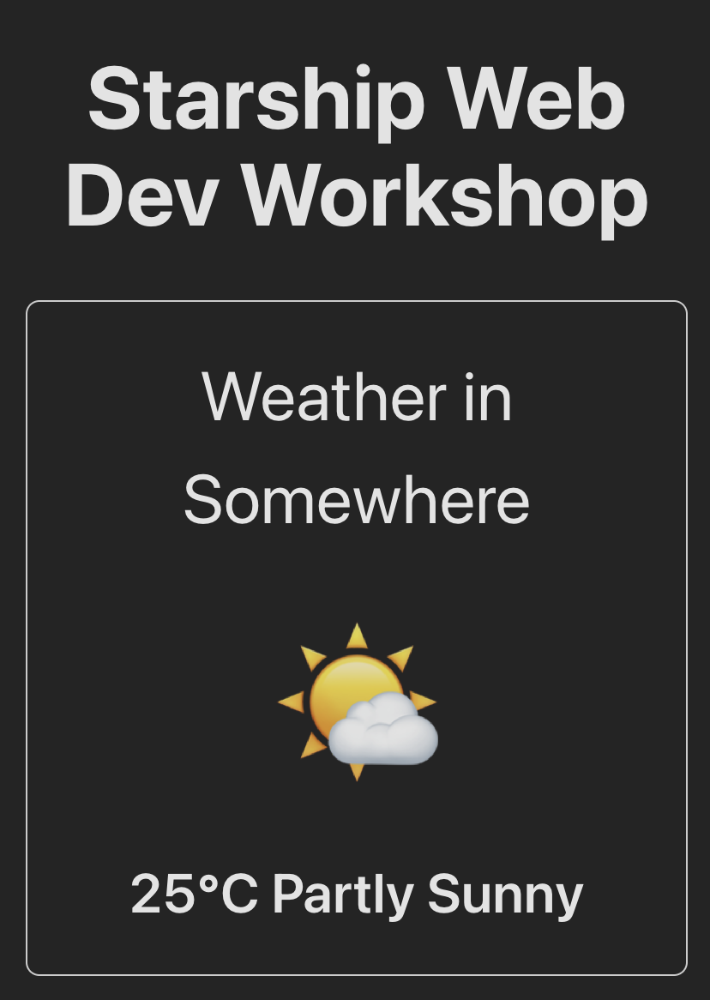
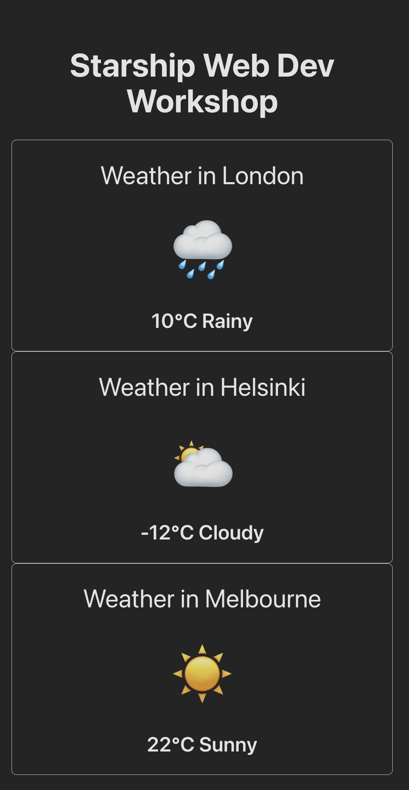
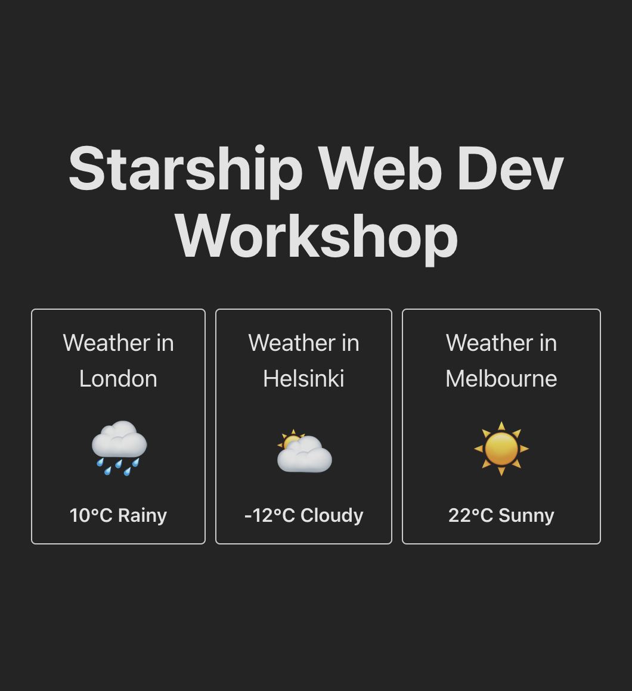
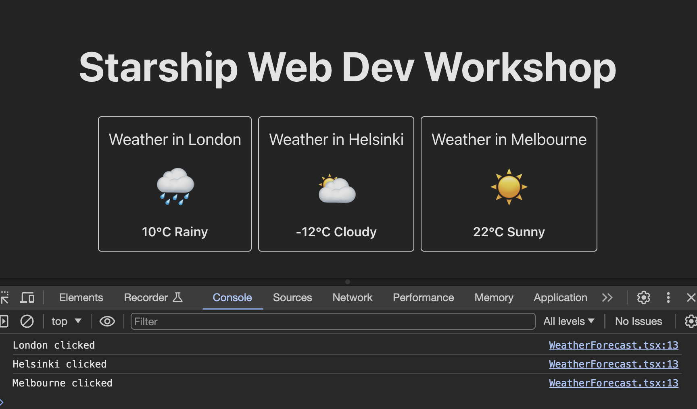

# React Basics

Let's learn basics of react by trying to make something little bit more useful.

- Rename `src/components/MyComponent.tsx` file to `src/components/WeatherForecast.tsx`
- Rename the function name from `MyComponent` to `WeatherForecast`.
- Update the import to it from `src/App.tsx`.
- Clean up `src/App.tsx` remove the code we won't use.
- Change usage of `MyComponent` in jsx to `WeatherForecast`.

Then your "src/components/WeatherForecast.tsx" should look like this
```tsx
export default function WeatherForecast() {
  return null; // Returning null means we show "nothing"
}
```

And your **src/App.tsx** should look like this;
```tsx
import "./App.css";
import WeatherForecast from "./components/WeatherForecast"; // This used to be MyComponent

function App() {
  return (
    <>
      <h1>Starship Web Dev Workshop</h1>
      <div>
        <WeatherForecast />
        {/* We deleted code from here. You put comments like this in jsx */}
      </div>
    </>
  );
}

export default App;
```

when we go to [localhost:8000](https://localhost:8000) we should se a page like this.


Let's go back to `WeatherForecast.tsx` and show some arbitrary weather forecast.

```tsx
import "./WeatherForecast.css";

export default function WeatherForecast() {
  return (
    <div className="weather-forecast">
      <div className="weather-forecast-title">Weather in Somewhere</div>
      <div className="weather-forecast-icon">🌤</div>
      <div className="weather-forecast-value">25°C Partly Sunny</div>
    </div>
  );
}
```

Also add a new CSS file `WeatherForecast.css` next to `WeatherForecast.tsx`. And add the styles below; 

```css
.weather-forecast {
  display: flex; /* Sets the display property of the element to flex */
  padding: 1.5em; /* Adds padding to all sides of the element */
  flex-direction: column; /* Sets the direction of flex items to be stacked vertically */
  flex-wrap: wrap; /* Allows flex items to wrap onto multiple lines if needed */
  justify-content: center; /* Aligns flex items along the vertical center of the container */
  border: 1px solid #ccc; /* Adds a 1px solid border with the color */
  border-radius: 0.5em; /* Rounds the corners of the element with a radius*/
  gap: 1em; /* Sets the gap between flex items*/
}

.weather-forecast-title {
  font-size: 2.5em;
}

.weather-forecast-value {
  font-weight: 600;
  font-size: 2em;
}

.weather-forecast-icon {
  font-size: 6em;
}
```

Vite knows how to collect all the css we used and bundle into single js and css files.
When you browse `localhost:8000` it should look like this



## Using props

Let's say if we wanted to show another place's weather also without copy pasting the code in `WeatherForecast` component.

We can supply some variable data the component. And in the component we can read them and show them dynamically. This is called passing props. Props are as in properties of a function.

React is fundamentally a ui renderer that is similar to a math function that takes data as a parameter and outputs ui as a result

`F(DATA) -> UI`

In this case `F` is our component. Data is the `props` and `UI` is what the component shows when it is used in the layout.

### Sending in values

Let's modify the `WeatherForecast` function so that it can take props.

We add a new type `WeatherForecastProps` then use it as the type of the parameter that the function takes, which is our component.

```tsx
import "./WeatherForecast.css";

type WeatherForecastProps = {
  city: string;
  temperature: number;
  description: string;
  icon: string;
};

export default function WeatherForecast(props: WeatherForecastProps) {
  return (
    <div className="weather-forecast">
      <div className="weather-forecast-title">Weather in {props.city}</div>
      <div className="weather-forecast-icon">{props.icon}</div>
      <div className="weather-forecast-value">
        {props.temperature}°C {props.description}
      </div>
    </div>
  );
}
```

And then we modify `src/App.tsx` so that we supply the parameters (props) to `WeatherForecast` function (component).

```diff
  ...
  <div>
-   <WeatherForecast />
+   <WeatherForecast
+      city={"London"}
+      temperature={10}
+      description={"Rainy"}
+      icon={"🌧"}
+    />
  </div>
  ...
```

Now that our component is configurable with props. We can reuse same code and styles for displaying other cities. Let's add 2 other cities.

```diff
 ...
 <div>
   <WeatherForecast
     city="London"
     temperature={10}
     description="Rainy"
     icon="🌧"
   />
+  <WeatherForecast
+    city="Helsinki"
+    temperature={-12}
+    description="Cloudy"
+    icon="🌥"
+  />
+  <WeatherForecast
+    city="Melbourne"
+    temperature={22}
+    description="Sunny"
+    icon="☀️"
+  />
 </div>
 ...
```

Now `localhost:8000` should look like this.



Let's add some styles so it looks bit nicer.

Add this class to the end of `App.css`
```css
.forecasts-container {
  display: flex;
  flex-direction: row;
  justify-content: center; /* centers items in this element horizontally */
  gap: 1em;
  font-size: 0.5em;
}
```

And also in `App.tsx`

```diff
 ...
 return (
   <>
     <h1>Starship Web Dev Workshop</h1>
_    <div>
+    <div className="forecasts-container">
       <WeatherForecast
         city="London"
  ...
```

Now we should see that they got smaller and displayed next to each other.
Notice that we didn't modify the font sizes in the classes of `WeatherForecast.css` yet they got smaller because we gave containing `forecasts-container` the font-size of `0.5em`. This is the expected behavior of css because `em` and values are relative to their containers. If we set particular `px` (pixel) values this wouldn't happen.

This is an anti-pattern though. Wanted to show you what happens if you that it has an effect if you set a font-size to a parent element. If the children have relative sizes. We normally don't do this. It achieved the look we wanted in this case but soon later we will do re-do this more properly.



### Sending in callbacks

Say we wanted the component to tell us when we clicked on it. We can implement this using callbacks.
Callbacks are regular functions passed in as props just like how we passed in values of city, temperature, icon etc. So when we pass a reference of a function to a component. The component can call this function so the function gets executed at the sender's side.

So in our case we will add a `onClick` prop to our `WeatherForecast` component. Then send the function from `App` root component.

This is kind of like, saying "tell me when I should know about something" to `WeatherForecast` component.

We can add `onClicked` to the type of the prop argument of the `WeatherForecast`

then pass it as an event handler to root element of the component.

```diff
 ...
 type WeatherForecastProps = {
   city: string;
   temperature: number;
   description: string;
   icon: string;
+  onClick: (city: string) => void;
 };
 
 export default function WeatherForecast(props: WeatherForecastProps) {
+  const handleOnClick = () => {
+    console.log(props.city + " clicked");
+  };
   return (
-    <div className="weather-forecast">
+    <div className="weather-forecast" onClick={handleOnClick}>
       <div className="weather-forecast-title">Weather in {props.city}</div>
       <div className="weather-forecast-icon">{props.icon}</div>
  ...
```

Browse to `localhost:8000` and reveal the javascript console (option + cmd + j on mac). Then try clicking on the city components, you should see these logs appearing.



Let's have the `App` root component be aware of this. Let's add the function callback value there.

in **src/App.tsx** we create the handler function. Then pass it along to each implementation of `WeatherForecast` component;

```diff
 function App() {
+   const handleOnForecastCityClicked = (city: string) => {
+     console.log(city + " clicked");
+   };
   return (
     <>
       <h1>Starship Web Dev Workshop</h1>
       <div className="forecasts-container">
         <WeatherForecast
           city="London"
           temperature={10}
           description="Rainy"
           icon="🌧"
+          onClick={handleOnForecastCityClicked}
         />
         <WeatherForecast
           city="Helsinki"
           temperature={-12}
           description="Cloudy"
           icon="🌥"
+          onClick={handleOnForecastCityClicked}
         />
         <WeatherForecast
           city="Melbourne"
           temperature={22}
           description="Sunny"
           icon="☀️"
+          onClick={handleOnForecastCityClicked}
         />
       </div>
     </>
   );
 }
```

Now `App` parent component is given callback functions as props and it is expecting `WeatherForecast` instances to call it. We need to add the like that calls the callback function coming as a prop.

in **src/components/WeatherForecast.tsx** we replace the console log with prop function call. We pass the city as a parameter so `App` knows which city was clicked;

```diff
...
 export default function WeatherForecast(props: WeatherForecastProps) {
   const handleOnClick = () => {
-    console.log(props.city + " clicked");
+    props.onClick(props.city);
   };
   return (
 ...
```

If you try clicking on the cities again you will see the same console logs appearing, but now they are logged from the root component.

## Using the state hook

Let's keep track of which city was clicked and show if above them.
In **App.tsx** add a new subtitle above the forecast components, below the title.

```diff
...
   <h1>Starship Web Dev Workshop</h1>
+  <h3>Selected city: {}</h3>
   <div className="forecasts-container">
...
```

To keep track of things in react we use the **"state hook"**. It is a special function provided by react library that we can use in our components. When implemented it looks like this;

```js
// javascript
const [value, updateValue] = useState(initialValue)
```

value: is the current value of this state
updateValue: is a function that we call to set a different value to the state
calling `useState(initialValue)` keeps track of the current state and **trigger a re-render of the component only when the value gets updated**

This means that we don't need to check the current value in a loop or register and event listener. When we use the state hook React is smart to know when it needs to re-paint the screen.

In our case;
```ts
// typescript
const [selectedCity, updateSelectedCity] = useState<string | null>(null)
```

We put `null` as `initialValue` because we don't know which city is selected yet.
Let's implement this in `App.tsx`

```diff
 import "./App.css";
+import { useState } from "react";
 import WeatherForecast from "./components/WeatherForecast";
 
 function App() {
+  const [selectedCity, updateSelectedCity] = useState<string | null>(null);
 
   const handleOnForecastCityClicked = (city: string) => {
-    console.log(city + " clicked");
+    updateSelectedCity(city);
   };
 
   return (
     <>
       <h1>Starship Web Dev Workshop</h1>
-      <h3>Selected city: {}</h3>
+      <h3>Selected city: {selectedCity}</h3>
       <div className="forecasts-container">
         <WeatherForecast
           city="London"
 ...
```

Now when we open `localhost:8000` and click on the cities we should see that value next to "Selected city" changes

https://github.com/eralpship/web-dev-workshop/assets/106536625/b9fc6dc2-d745-4527-b8e4-6b6943175322

Checkout the branch `react-basics` for the latest state of the files.
