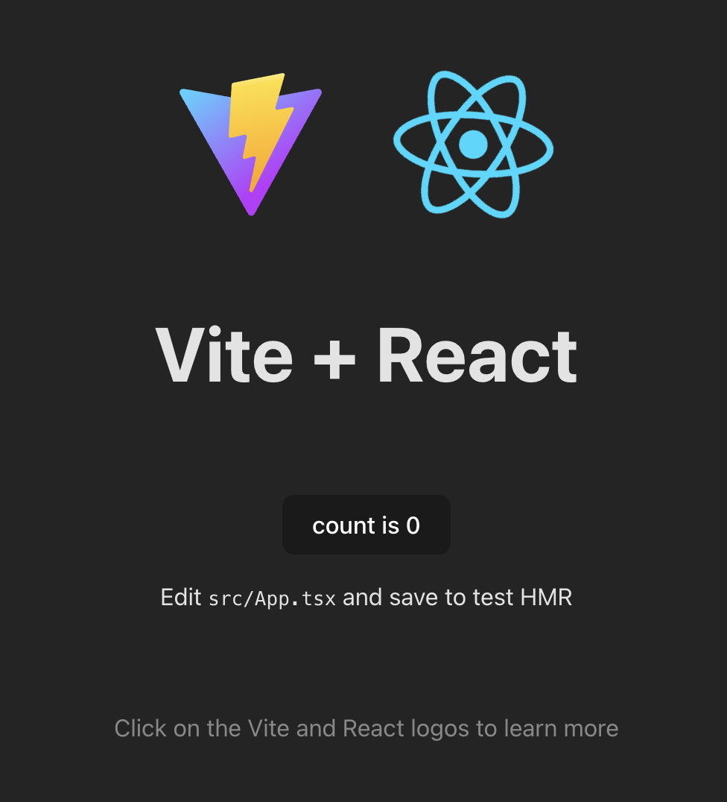

# Setup

I prepared a development docker container so you don't have to waste time installing the right nodejs version. I recommend working inside the container for this workshop. However it is optional. If you feel confident with installing nodejs, check the required node version in `.nvmrc` file. Skip to Install Dependencies secion and run the command directly on your local setup. 

- Start docker desktop if it is not running already

- Build the development image on your local machine
```sh
docker-compose up --build --no-recreate -d
```

Check the status of the docker container
```sh
docker-compose ps
```
You should see this
```sh
vite_docker   /bin/sh   Up      0.0.0.0:8000->8000/tcp
```

Access docker container's shell

```sh
docker exec -it vite_docker sh
```

- Install dependencies 
```sh
# Run this in docker container's shell
npm i 
```

- Run the development server
```sh
# Run this in docker container's shell
npm run dev
```

Point your browser to [http://localhost:8000](http://localhost:8000).

You should see this page:



- Check if hot reload / hot module replacing (HMR) works. try editing the file `src/App.tsx` ie:
```diff
- <h1>Vite + React</h1>
+ <h1>Starship</h1>
```
When you save you should see the text at the center of the page change automatically without refreshing the page.

If you are on Windows and HMR doesn't work see `vite.config.ts` file and uncomment the relevant lines.
