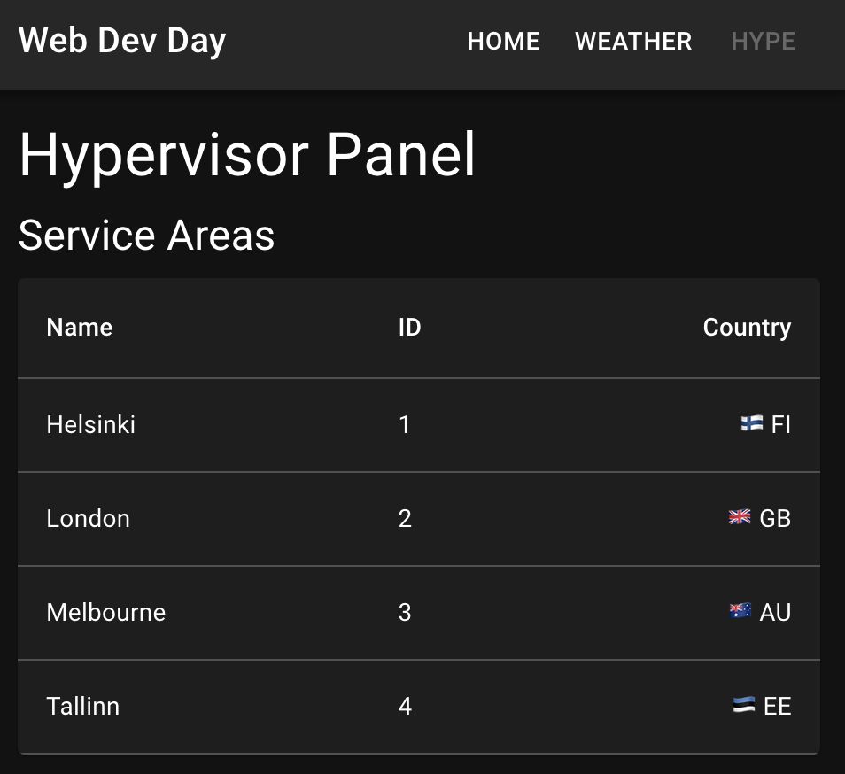
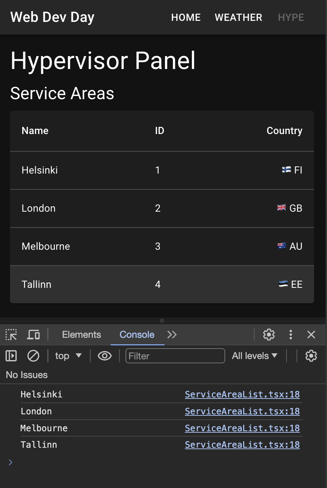

# Displaying data in tables

The way we displayed the ServiceArea list is not very legible, we can improve it by using other components from MUI, such as `Table` and along with its child components `TableBody`, `TableCell`, `TableContainer`, `TableHead`, `TableRow`, 

Here's the [documentation for MUI Table](https://mui.com/material-ui/react-table/). It has many features, but for our scope we will only see few of them. I recommend you can check on your own time. 

## Implementing MUI Tables

Let's refactor `HypePage.tsx`. We created a `ServiceAreaList` component in it. We can extract it from there and move to its own file at `src/components/ServiceAreaList.tsx`. And rewrite it's layout using MUI's `Table` component.

**src/pages/HypePage.tsx**

```diff
-import {
-  gql,
-  useSuspenseQuery as useApolloSuspenseQuery,
-} from "@apollo/client";
 import Alert from "@mui/material/Alert/Alert";
-import Paper from "@mui/material/Paper";
 import Typography from "@mui/material/Typography";
 import { Suspense } from "react";
 import { ErrorBoundary } from "react-error-boundary";
-import { ServiceArea } from "../generated/types/server";
-import Box from "@mui/material/Box";
+import ServiceAreaList from "../components/ServiceAreaList";
 
 export default function HypePage() {
   return (
     ...
     </>
   );
 }
-
-function ServiceAreaList() {
-  const {
-    data: { serviceAreas },
-  } = useApolloSuspenseQuery<{ serviceAreas: ServiceArea[] }>(
-    AllServiceAreasQuery
-  );
-  return (
-    <Paper
-      sx={{
-        display: "flex",
-        flexDirection: "column",
-        padding: 2,
-      }}
-    >
-      <Box>{`id country name`}</Box>
-      {serviceAreas.map((serviceArea) => (
-        <Box key={serviceArea.id}>
-          {`${serviceArea.id} ${serviceArea.countryCode} ${serviceArea.name} `}
-        </Box>
-      ))}
-    </Paper>
-  );
-}
-
-const AllServiceAreasQuery = gql`
-  query AllServiceAreasQuery {
-    serviceAreas {
-      id
-      countryCode
-      name
-    }
-  }
-`;
```

Create a new file at `src/components/ServiceAreaList.tsx`.

**src/components/ServiceAreaList.tsx**

```tsx
import {
  gql,
  useSuspenseQuery as useApolloSuspenseQuery,
} from "@apollo/client";
import Paper from "@mui/material/Paper";
import Table from "@mui/material/Table";
import TableBody from "@mui/material/TableBody";
import TableCell from "@mui/material/TableCell";
import TableContainer from "@mui/material/TableContainer";
import TableHead from "@mui/material/TableHead";
import TableRow from "@mui/material/TableRow";

import { ServiceArea } from "../generated/types/server";

export default function ServiceAreaList() {
  const {
    data: { serviceAreas },
  } = useApolloSuspenseQuery<{ serviceAreas: ServiceArea[] }>(
    AllServiceAreasQuery
  );

  return (
    <TableContainer component={Paper}>
      <Table>
        <TableHead>
          <TableRow>
            <TableCell>Name</TableCell>
            <TableCell>ID</TableCell>
            <TableCell align="right">Country</TableCell>
          </TableRow>
        </TableHead>
        <TableBody>
          {serviceAreas.map((serviceArea) => (
            <TableRow key={serviceArea.id}>
              <TableCell>{serviceArea.name}</TableCell>
              <TableCell>{serviceArea.id}</TableCell>
              <TableCell align="right">
                {countryCodeToFlag(serviceArea.countryCode)}{" "}
                {serviceArea.countryCode}
              </TableCell>
            </TableRow>
          ))}
        </TableBody>
      </Table>
    </TableContainer>
  );
}

function countryCodeToFlag(countryCode: string) {
  return String.fromCodePoint(
    ...[...countryCode.toUpperCase()].map(
      (char) => 0x1f1a5 + char.charCodeAt(0)
    )
  );
}

const AllServiceAreasQuery = gql`
  query AllServiceAreasQuery {
    serviceAreas {
      id
      countryCode
      name
    }
  }
`;
```

- We are fetching graphql api exactly the same way as before.
- We used `TableCell`s to display values instead.
- We display flag emoji's for the country codes using an utility function `countryCodeToFlag`

If you view `localhost:8000/hype` it should look like this;



Service area list looks much better now however we need to add few more features to our implementation.

## Creating a reusable table view

- We should make this table re-usable for other kinds of data as well. SupportTicket's and Bot's can reuse the same table implementation.
- Last row of the table renders a separator as ones before, should fix that.
- We can't click on rows. Ideally clicking on rows should go to detail page.

Let's create a new `CommonDataTable` component. We can tackle the points above by implementing a common component which has the same components and styles from before, but takes the cell elements from parent as prop.

`CommonDataTable` could take these props

- `rows`: array of items to show
- `onRowClicked`: a callback to tell the parent that a row has been clicked
- `columnHeaders`: Headers of the columns, Like the ones we had: Name, Id, Country.
- `cellsForRow`: another callback prop. Implementation of it takes a row, and returns `cells`, a list of react nodes, and a unique key to pass to `TableRow` instances.

This new component can not know what typescript type of elements it takes as rows, because we are intending to re-use this for different kinds of data. However we need to define a type for `rows`. 
We can implement this by using [TypeScript Generics](https://www.typescriptlang.org/docs/handbook/2/generics.html). 

`CommonDataTable<T>` definition can take a `T` generic type. Then we can pass it around in the implementation of `CommonDataTable<T>` without knowing what `T` is.

This Typescript feature works with react as well because React components are regular Typescript functions. There's nothing specific or special to react happening about this.

You can copy-past this into `src/components/CommonDataTable.tsx`.

**src/components/CommonDataTable.tsx**

```tsx
import Paper from "@mui/material/Paper";
import Table from "@mui/material/Table";
import TableBody from "@mui/material/TableBody";
import TableCell from "@mui/material/TableCell";
import TableContainer from "@mui/material/TableContainer";
import TableHead from "@mui/material/TableHead";
import TableRow from "@mui/material/TableRow";

type CommonTableProps<T> = {
  rows: T[];
  onRowClicked: (row: T) => void;
  columnHeaders: React.ReactNode[];
  cellsForRow: (row: T) => { key: string; cells: React.ReactNode[] };
};

export function CommonDataTable<T>({
  rows,
  onRowClicked,
  columnHeaders,
  cellsForRow,
}: CommonTableProps<T>) {
  const numberOfColumns = columnHeaders.length;
  const isIndexLastColumn = (index: number) => index === numberOfColumns - 1;

  return (
    <TableContainer component={Paper}>
      <Table>
        <TableHead>
          <TableRow>
            {columnHeaders.map((headerCell, index) => (
              <TableCell
                key={index}
                align={isIndexLastColumn(index) ? "right" : "left"}
              >
                {headerCell}
              </TableCell>
            ))}
          </TableRow>
        </TableHead>
        <TableBody>
          {rows
            .map((row) => cellsForRow(row))
            .map(({ key, cells }, index) => (
              <TableRow
                hover
                key={key}
                onClick={() => onRowClicked(rows[index])}
                sx={{ "&:last-child td, &:last-child th": { border: 0 } }}
              >
                {cells.map((cell, index) => (
                  <TableCell
                    sx={{ cursor: "pointer" }}
                    scope="row"
                    key={index}
                    align={isIndexLastColumn(index) ? "right" : "left"}
                  >
                    {cell}
                  </TableCell>
                ))}
              </TableRow>
            ))}
        </TableBody>
      </Table>
    </TableContainer>
  );
}
```

This table implementation is not too different than the previous other than generics and props. Has very few additions.

- we detect the last row column, so we align it to right.
- we added `sx={{ "&:last-child td, &:last-child th": { border: 0 } }}` to `TableRow` style. So that last row at the end would not render a separator border.
- Implemented the `onRowClicked` callback.
- Enabled `hover` for row elements
- 

Now let's implement this new `CommonDataTable` component in `ServiceAreaList`

**src/components/ServiceAreaList.tsx**

```diff
  import {
    gql,
    useSuspenseQuery as useApolloSuspenseQuery,
  } from "@apollo/client";
- import Paper from "@mui/material/Paper";
- import Table from "@mui/material/Table";
- import TableBody from "@mui/material/TableBody";
- import TableCell from "@mui/material/TableCell";
- import TableContainer from "@mui/material/TableContainer";
- import TableHead from "@mui/material/TableHead";
- import TableRow from "@mui/material/TableRow";
+ import { CommonDataTable } from "./CommonDataTable";
  
  import { ServiceArea } from "../generated/types/server";
  
  export default function ServiceAreaList() {
    ...
  
    return (
-     <TableContainer component={Paper}>
-       <Table>
-         <TableHead>
-           <TableRow>
-             <TableCell>Name</TableCell>
-             <TableCell>ID</TableCell>
-             <TableCell align="right">Country</TableCell>
-           </TableRow>
-         </TableHead>
-         <TableBody>
-           {serviceAreas.map((serviceArea) => (
-             <TableRow key={serviceArea.id}>
-               <TableCell>{serviceArea.name}</TableCell>
-               <TableCell>{serviceArea.id}</TableCell>
-               <TableCell align="right">
-                 {countryCodeToFlag(serviceArea.countryCode)}{" "}
-                 {serviceArea.countryCode}
-               </TableCell>
-             </TableRow>
-           ))}
-         </TableBody>
-       </Table>
-     </TableContainer>
+     <CommonDataTable
+       onRowClicked={(a) => console.log(a.name)}
+       rows={serviceAreas}
+       columnHeaders={["Name", "ID", "Country"]}
+       cellsForRow={(serviceArea) => ({
+         key: serviceArea.id,
+         cells: [
+           serviceArea.name,
+           serviceArea.id,
+           `${countryCodeToFlag(serviceArea.countryCode)} ${
+             serviceArea.countryCode
+           }`,
+         ],
+       })}
+     />
    );
  }
  
  function countryCodeToFlag(countryCode: string) {
    ...
  }
  
  const AllServiceAreasQuery = gql`
    ...
  `;
```

Now when you check `localhost:8000/hype` you should see about the same table. But you should be able to highlight rows, and when you click them you should see a console log at javascript terminal.



Final implementation of `ServiceAreaList.tsx` should be like this;

**src/components/ServiceAreaList.tsx**

```tsx
import {
  gql,
  useSuspenseQuery as useApolloSuspenseQuery,
} from "@apollo/client";

import { ServiceArea } from "../generated/types/server";
import { CommonDataTable } from "./CommonDataTable";

export default function ServiceAreaList() {
  const {
    data: { serviceAreas },
  } = useApolloSuspenseQuery<{ serviceAreas: ServiceArea[] }>(
    AllServiceAreasQuery
  );

  return (
    <CommonDataTable
      onRowClicked={(a) => console.log(a.name)}
      rows={serviceAreas}
      columnHeaders={["Name", "ID", "Country"]}
      cellsForRow={(serviceArea) => ({
        key: serviceArea.id,
        cells: [
          serviceArea.name,
          serviceArea.id,
          `${countryCodeToFlag(serviceArea.countryCode)} ${
            serviceArea.countryCode
          }`,
        ],
      })}
    />
  );
}

function countryCodeToFlag(countryCode: string) {
  return String.fromCodePoint(
    ...[...countryCode.toUpperCase()].map(
      (char) => 0x1f1a5 + char.charCodeAt(0)
    )
  );
}

const AllServiceAreasQuery = gql`
  query AllServiceAreasQuery {
    serviceAreas {
      id
      countryCode
      name
    }
  }
`;
```

Later we'll see about how we can implement `CommonDataTable` for SupportTicket's and Bot's.

## Table loading state.

Would be also nice if we can still show a "skeleton" version of the table while it is loading. We can implement this using `Skeleton` components from MUI. We used them before in weather components.

We can now make a generic loading state implementation of `CommonDataTable` which renders `Skeleton`s instead of values.

We will create the component `CommonDataTableSkeleton` and assign it to `CommonDataTable` component. So that we can use it as `<CommonDataTable.Skeleton />`.

This is another language feature which has nothing to do with React. Usually special implementations of components are defined this way. This is kind of name spacing for components.

We should also make the `onRowClicked` optional because skeleton doesn't require items to be clicked.

**src/components/CommonDataTable.tsx**

```diff
 import Paper from "@mui/material/Paper";
+import Skeleton from "@mui/material/Skeleton";
 import Table from "@mui/material/Table";
 import TableBody from "@mui/material/TableBody";
 import TableCell from "@mui/material/TableCell";
 ...
 
 type CommonTableProps<T> = {
   rows: T[];
-  onRowClicked: (row: T) => void;
+  onRowClicked?: (row: T) => void;
   columnHeaders: React.ReactNode[];
   cellsForRow: (row: T) => { key: string; cells: React.ReactNode[] };
 };
               ...
               <TableRow
                 hover
                 key={key}
-                onClick={() => onRowClicked(rows[index])}
+                onClick={() => onRowClicked?.(rows[index])}
                 sx={{ "&:last-child td, &:last-child th": { border: 0 } }}
               >
                 {cells.map((cell, index) => (
     ...
     </TableContainer>
   );
 }
+
+CommonDataTable.Skeleton = function CommonDataTableSkeleton({
+  columnHeaders,
+}: {
+  columnHeaders: React.ReactNode[];
+}) {
+  return (
+    <CommonDataTable
+      rows={[{}]}
+      columnHeaders={columnHeaders}
+      cellsForRow={() => ({
+        key: "skeleton-row",
+        cells: columnHeaders.map((_, index) => [
+          <Skeleton key={index} variant="text" animation="wave" />,
+        ]),
+      })}
+    />
+  );
+};
```

Then we can implement our new `CommonDataTable.Skeleton` at `ServiceAreaList` first, because it needs to now the table headers.

```diff
 import { ServiceArea } from "../generated/types/server";
 import { CommonDataTable } from "./CommonDataTable";
 
+const TableColumnHeaders = ["Name", "ID", "Country"];
+
 export default function ServiceAreaList() {
   const {
     data: { serviceAreas },
     ...
     <CommonDataTable
       onRowClicked={(a) => console.log(a.name)}
       rows={serviceAreas}
-      columnHeaders={["Name", "ID", "Country"]}
+      columnHeaders={TableColumnHeaders}
       cellsForRow={(serviceArea) => ({
         key: serviceArea.id,
         cells: [
         ...
   );
 }
 
+ServiceAreaList.Skeleton = () => (
+  <CommonDataTable.Skeleton columnHeaders={TableColumnHeaders} />
+);
+
 function countryCodeToFlag(countryCode: string) {
   return String.fromCodePoint(
     ...[...countryCode.toUpperCase()].map(
```

Similar to how we defined `CommonDataTable.Skeleton` we can define an implementation of the common skeleton for `ServiceAreaList`, as `ServiceAreaList.Skeleton`

Then finally we can use `<ServiceAreaList.Skeleton />` in `HypePage` as Suspense fallback.

And we can also move "Service Areas" title out of the suspense so it is rendered even when query is loading.

**src/pages/HypePage.tsx**

```diff
       ...
       <Typography variant="h4" component="h2">
         Hypervisor Panel
       </Typography>
+      <Typography variant="h5" component="h3">
+        Service Areas
+      </Typography>
       <ErrorBoundary
         fallbackRender={({ error }) => (
           <Alert severity="error">{error.message}</Alert>
         )}
       >
-        <Suspense fallback={<div>Loading...</div>}>
-          <Typography variant="h5" component="h3">
-            Service Areas
-          </Typography>
+        <Suspense fallback={<ServiceAreaList.Skeleton />}>
           <ServiceAreaList />
         </Suspense>
       </ErrorBoundary>
```

Go to `localhost:8000/hype` and refresh the page several times. You should be able to see the loading state skeleton.

[hype page skeleton](assets/hype-table-skeleton.gif)

